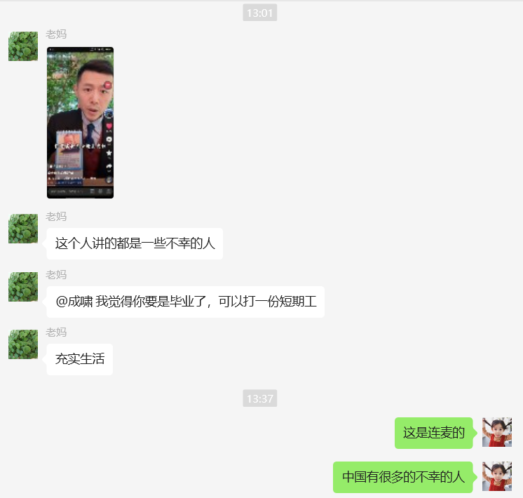

## Part 1
早上10点半起来看《理想国》第二章下册，结合罗翔老师的讲解。罗翔老师经常说着说着就强调自己只是带着大家看，和大家交流，自己其实也不是很懂理想国，听的老夫耳朵都快起茧了。
苏格拉底在分析何为真正的正义，他提出由大见小。那么何为大，何为小？大就是集体的正义，小就是个人的正义，所以他先分析集体的正义，集体由个人组成，所以最后也会归结到个人的正义。要分析集体的正义，就必须先分析城邦（集体）的起源。首先他先说明城邦里的人各司其职，专心做一种事情是好的，很显然，要不然一个人又要种水稻又要做饭还要做衣服。哦，他甚至还提了一嘴，人只有从事他所感兴趣的行业才是幸福的，否则会很悲哀。而只有根据每个人的特点以及能力，给人分类干活，这样的城邦才是健康的。

<iframe src="https://player.bilibili.com/player.html?isOutside=true&aid=940650445&bvid=BV16W4y1U7sw&cid=765568769&p=4&autoplay=0" scrolling="no" border="0" frameborder="no" framespacing="0" allowfullscreen="true"></iframe>

## Part 2
感觉用github来记录日记是非常没有美感的事情，所以我今天花了部分时间，结合视频教程，做了一个小的网站，可以非常方便的用obsidian和git进行笔记的制作。制作的时候感觉自己很难把抽象融入到这个小破站里面，而且在主页的制作上我犹豫了会儿，是放爱情主题还是放个人主题。最后还是选择了个人主题，因为感觉爱情主题有点太肉麻了。
<iframe src="https://player.bilibili.com/player.html?isOutside=true&aid=112699639859709&bvid=BV19X3veCEn5&cid=500001599823789&p=1&autoplay=false" scrolling="no" border="0" frameborder="no" framespacing="0" allowfullscreen="true"></iframe>

## Part 3
中午和小璇同学打了4个小时的守望，小璇同学还偷偷隐身练枪，非常感动，打游戏的时候感觉她盯着我奶，以后给盾要给的更勤快点。
小璇同学指出我两周没干活了，确实天天和朋友厮混，需要赶紧收收心，周末再出去玩吧。

## Part 4

今天老爸早上提醒我要准备博士考试了，我下午才回复，下次不能拖这么久。
给老妈推荐了大冰老师，但是老妈好像不太喜欢看，不知道我能不能说服她去看。大冰老师对很多事情的看法和我挺像的，都觉得人生本身没有意义，且人生的底色是悲凉的。他自己也陷入了虚无主义，他说自己现在就是在浪费自己的人生，直到他找到努力的动力，不过目前他还没找到。我妈要是想法和大冰差不多就好，那我就能为所欲为了。

经典短期工，我高中毕业就去干了一个多月的上菜员，还是喜欢苦难教学，没道理。
## Part 5 
晚上下着小雨，我在雨中走了1.6km去吃昨天晚上买的必胜客59元两件套，这个必胜客现在都要用上AI了嘛，我真是没想到。

## Part 6
分享今天看到的有意思的视频啦。
我关注的up主“莱多一份”，这mv做的也太搞了，我要逐帧学习。
<iframe src="https://player.bilibili.com/player.html?isOutside=true&aid=114008564703020&bvid=BV1CRANeHEa7&cid=28410317373&p=1&autoplay=false" scrolling="no" border="0" frameborder="no" framespacing="0" allowfullscreen="true"></iframe>
本来我寻思后面两哥们儿会缠着打起来，结果缠着吻起来了。直接给我整的绷不住了。

今天没在朋友身上花时间，bingo!
