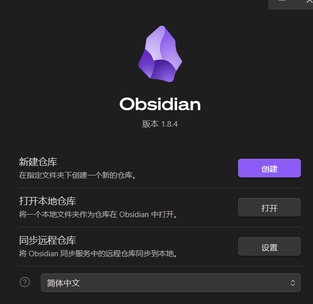
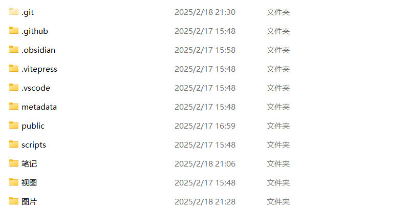
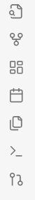
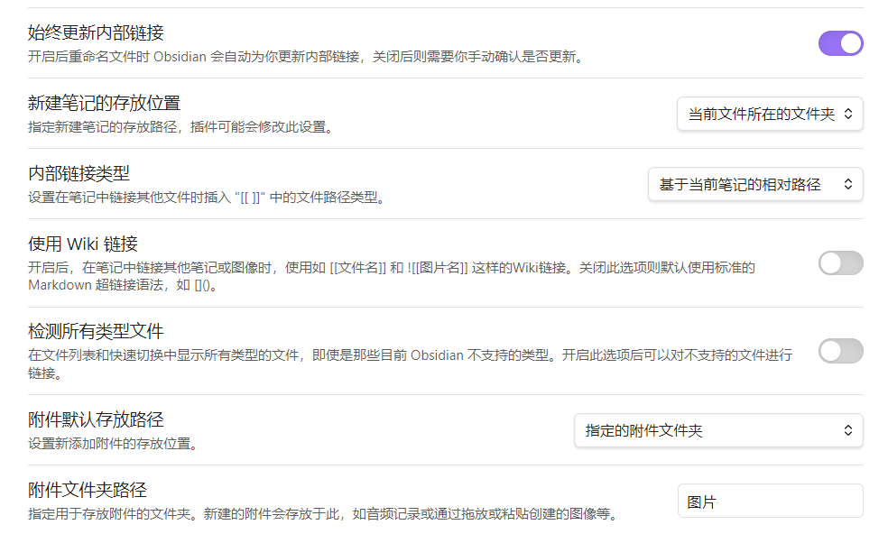
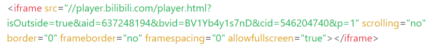
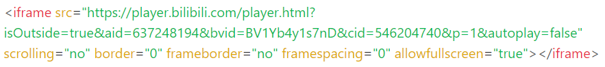

## Obsidian打开日记仓库
Obsidian是一款类似Notion的笔记软件，但是他的每一个笔记都会被保存成MarkDown格式的文件，并且它还和 git 耦合在一起，改完就可以立刻提交。

首先下载Obsidian并安装。

点击打开本地仓库，将刚才git仓库打开，系统会自动生成一个.obsidian文件，如下图所示

然后就可以在里面新建md笔记并编辑啦。

## 插件
左下角设置->第三方插件->安全模式 关闭

浏览商店，搜索 Git 和 Paste image rename 两个插件，记得点击启用。然后在最左侧的最下方就会出现 git 的按钮，点击 git 按钮，就可以快速的提交md到远程仓库了。

Paste image rename是粘贴图片时对图片进行重命名操作。

## 设置
设置->文件与链接 ，设置成如下，方便图片和新建笔记的存储。这个Wiki链接也要改。

还有个小Tip，就是图片的重命名里面最好不要有空格，如果有空格要用“20%”来表示。

## 插入视频

以b站举例，点击分享中的嵌入代码，然后粘贴到obsidian中。

代码显示如上，需要在网址的双斜杠前面加 “https:” 

如果要关闭自动播放，需要在 src 中加入 “&autoplay=false"

示例如下

