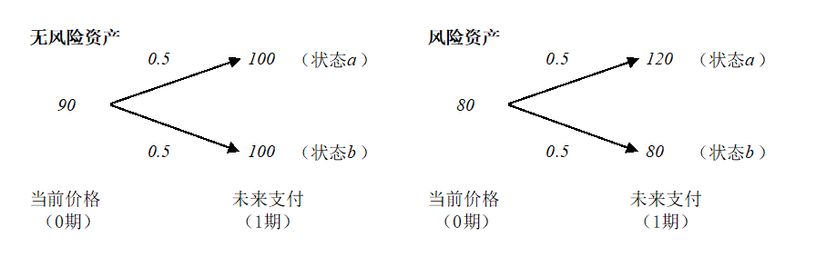
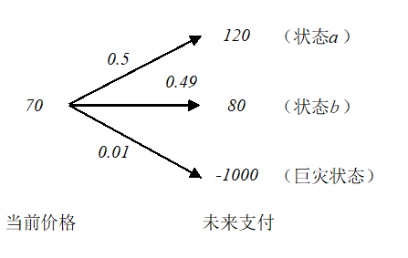
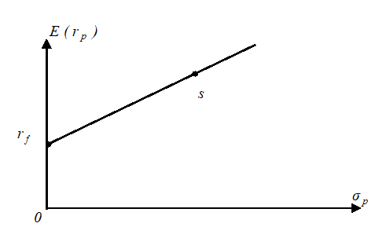
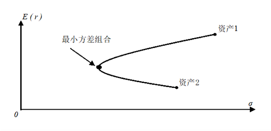
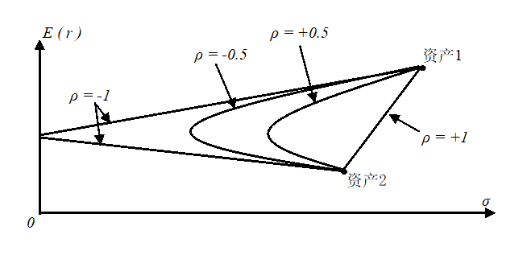
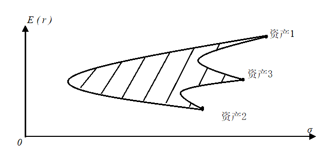
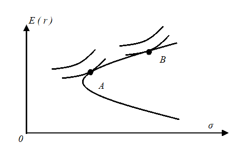
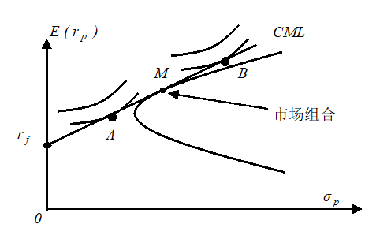

# 第5讲：均值方差分析

##  **1. 对均值和方差的解释**

在均值-方差分析中，均值是一种资产过去历史回报率的平均数，而方差是这种资产过去历史回报率的波动方差，我们相信均值和方差分别刻画了资产的收益和风险状况。

###  **1.1 事前回报率（期望回报率） vs. 事后回报率**

我们以图1中的无风险资产和风险资产为例进行说明。

图1

回报率可以分为事前回报率（ex-ante rate of return）和事后回报率（ex-post rate of return）。

如果我们站在0期来算，得到的就是事前回报率；而如果站在1期来算，得到的就是事后回报率。

事前回报率和事后回报率的最大差异在于不确定性是否揭示。计算事前回报率时，资产回报尚未实现，回报率究竟会是多少还无法确知，而只能预期。所以，事前回报率只能是预期回报率（expected rate of return），用资产未来的期望回报除以资产当前价格得到。而在计算事后回报率时，回报已经产生，计算回报率时没有任何不确定性。

对于图1中的风险资产而言，0期计算的事前回报率（也即期望回报率）等于
 $$E(r)=\frac{0.5\times 120+0.5\times 80}{80}-1=25\% $$  
而如果站在1期计算风险资产在0期和1期之间的事后回报率，会得到两种可能的结果（只有1种结果会实现）
 $$\begin{aligned} r_a&=\frac{120}{80}-1=50\%\\ r_b&=\frac{80}{80}-1=0\% \end{aligned} $$
 $r_a$ 和 $r_b$ 均为事后回报率，分别对应 $a$ 和 $b$ 两个状态下的资产回报率。

显然，事前回报率是事后回报率的加权平均。

而对于图1中的无风险资产而言，事前回报率为
 $$E(r_f)=\frac{0.5\times 100+0.5\times 100}{90}-1=11\% $$
事后回报率为
$$$r_{fa}=r_{fb}=\frac{100}{90}-1=11\%$$
无风险资产的事前回报率和事后回报率都是相等的。

现在我们要引入风险溢价的概念。风险溢价（risk premium）是风险资产的期望回报率超出无风险资产期望回报率的部分，是对风险资产持有者承担风险的补偿。这里要务必注意，风险溢价是用期望回报率（也就是事前回报率）之差来计算的。对事后回报率不能谈风险溢价。在上面的这个例子中，风险资产的风险溢价应该是  $E(r)-E(r_f)=25\%-11\%=14\%$。

在资产定价中，我们都是站在现在，试图用资产的期望回报定出资产现在的价格。在期望回报给定后，只要再找出期望回报率，就能得到资产现在的价格。这里的期望回报率就是我们说的贴现率。由于无风险回报率在现在就确定可知，所以风险资产定价的关键是找出其风险溢价。有了风险溢价，就有了期望回报率，也就有了资产价格。

___
###  **1.2 事后回报率均值 vs. 期望回报率**

期望回报率是对未来资产回报率的预估，但在现实中，我们往往用一类资产过去实现的事后回报率来预测其未来回报率。

让我们再来看前面例子中的风险资产。我们可以把这个风险资产想成某一类短期债券。观察这种债券过去的事后回报率表现，发现差不多有一半的时候它的事后回报率是50%，而另一半的时候事后回报率只是0%。可以算出这种债券在过去事后回报率的均值大致是25%。这样，我们在预期这个资产未来的回报率时，往往就会认为预期回报率等于过去事后回报率的均值。

在均值-方差分析中我们就是这样做的，用过去的事后回报率均值来代表期望回报率。类似地，我们会用过去事后观察到的回报率波动方差来代表回报率未来的期望波动方差。但在这里一定要清楚。虽然我们分析的数据都是事后回报率的均值和方差，但实际关心的是期望回报率（事前回报率），以及期望回报率中包含的风险溢价。

___
###  **1.3 方差和风险**

我们为什么假定无风险资产的波动率是0？

从历史数据中可以看到，无风险资产的收益率也存在波动。

但无风险收益率的本质特征是它在未来没有不确定性（我们确切地知道未来的回报率，例如我们知道未来三年回报率为1%、2%、3%，虽然未来三年回报率波动标准差不为0，但是收益率并不存在不确定性）。当我们买入无风险资产时，可以精确预期其未来会实现的回报率。

虽然均值方差分析中用波动率（或方差）来衡量风险，而且这个波动率还是用历史数据计算的，但风险的本质是不确定的未来。我们之所以认为那些过去回报波动率更大的资产风险越高，是因为基于历史数据，我们判断这些资产未来回报率的不确定性更大。如果投资者已经确知了资产未来3年的回报率（1%、2%、3%），那么尽管资产未来的回报率仍然会有波动，但它已经没有不确定性了。

___
###  **1.4 幸存者偏差**

在均值-方差分析中，我们用过去的历史数据来预估未来。但是，当我们用过去的事后回报率来推算未来的期望回报率时，幸存者偏差（survivorship bias）是必须要警惕的陷阱。

假设和有图2所示的一种资产。在巨灾状态发生时，资产的支付为-1000。巨灾状态发生的概率仅有1%，平时很难碰到。

图2

如果我们观察这一资产过去实现的事后回报率，会发现大概有一半的情况资产的回报率为71%（=120/70-1），另一半的情况资产回报率为14%（80/70-1）。将这两个回报率做简单平均，得到的回报率均值大概为43%（=（71%+14%）/2）。但如果就此认为这个资产的期望回报率就为43%，那就犯大错误了。这是因为我们在观察资产过去的表现时，其实并没有观察到巨灾状态的发生。而在市场定价时，是会把这种可能考虑在内的。如果把三种可能性都考虑在内，这种资产的期望回报率应该是
$$\frac{0.5\times 120+0.49\times 80+0.01\times (-1000)}{70}-1=27\% $$
很明显，在观察过去的历史数据时，我们没有看到巨灾状态的发生。因为那些遭遇了巨灾状态的资产已经退出资本市场了。

___

##  **2. 资产组合的均值方差特性**

资产组合（portfolio）是指由多种资产组合起来的一个资产集合。

资产组合可以被记为 $(w_1,w_2,\cdots,w_n)$ 其中 $w_i$ 是财富分配在第 $i$ 种资产的比例，显然 $\sum_{i=1}^n w_i=1$ 。 $w_i$ 可正可负也可为0（为正时表示做多某种资产，为负时表示做空某种资产，为0时表示不持有某种资产）。

下面我们会讨论两种基本的组合情况：一种无风险资产和一种风险资产的组合，以及两种风险资产的组合。由这两种组合方式就可以容易推演出更多种资产组合的结果。

###  **2.1 一种无风险资产和一种风险资产的组合**

首先，我们从最简单的情况，一种无风险资产和一种风险资产的组合开始。

在均值-方差分析中，我们认为无风险资产的波动率为0，收益率为一常数。  

假设无风险资产和风险资产的回报率分别为 $r_f$ 和 $r_s$ （显然， $r_s$ 是一个随机变量），风险资产回报率的均值和方差分别为 $\bar{r}_s$ 与 $\sigma_s$ 。由于无风险资产的收益率为常数，因此它与任何风险资产回报率的协方差均为0。

假设投在无风险资产和风险资产上的财富份额分别为 $1-w,w$ 。则组合的均值和波动方差分别为
$$\begin{aligned} \bar{r}_p&=E[(1-w)r_f+wr_s]=(1-w)r_f+w\bar{r}_s=r_f+w(\bar{r}_s-r_f)\\ \sigma_p^2&=E[(1-w)r_f+wr_s-(1-w)r_f-w\bar{r}_s]^2=E[w^2(r_s-\bar{r}_s)^2]=w^2\sigma_s^2 \end{aligned} $$
$$ \sigma_r^2=E(r-\bar{r})^2$$
进一步地，可得
 $$\bar{r}_p=r_f+\frac{\bar{r}_s-r_f}{\sigma_s}\sigma_p$$
上述关系在标准差-均值坐标系中为一条直线。如图3所示。

图3

显然，当 $w=0$ 时，组合的标准差-均值为 $(0,r_f)$ ；当 $w=1$ 时，组合的标准差-均值为 $(\sigma_s,\bar{r}_s)$ 。如果允许 $w>1$ （允许以无风险利率借入资金来购买风险资产），则直线段可以延伸到 $s$ 点右侧。

现在我们知道，一种无风险资产与一种风险资产的组合在标准差-均值坐标系中为一条直线。

___
###  **2.2 两种风险资产的组合**

假设两种风险资产的回报率分别为 $r_1$ 和 $r_2$ ，回报率均值分别为 $\bar{r}_1$ 和 $\bar{r}_2$ ，收益率的协方差为 $\sigma_{12}$ ，投在两种资产上的份额分别为 $w$ 与 $1-w$ 。

则组合的预期回报为
$$\bar{r}_p=E[r]=E[wr_1+(1-w)r_2]=w\bar{r}_1+(1-w)\bar{r}_2 $$
组合的回报率方差为
 $$\begin{aligned} \sigma_p^2&=E[wr_1+(1-w)r_2-w\bar{r}_1-(1-w)\bar{r}_2]^2\\ &=w^2\sigma_1^2+(1-w)^2\sigma_2^2+2w(1-w)\sigma_{12} \end{aligned} $$

随着 $w$ 从0变化到1，组合在标准差-均值坐标系上画出一条连接两个资产的双曲线。如果允许卖空风险资产（ $w$ 可能小于0或者大于1），组合的曲线可以向两端延伸。曲线的最左侧点代表通过组合所能达到的最小波动率。这个组合被称为“最小方差组合”。

图4

最小方差的一阶条件为
 $$\begin{aligned} \frac{\partial \sigma_p^2}{\partial w}=0\Rightarrow w^{*}=\frac{\sigma_2^2-\sigma_{12}}{\sigma_1^2+\sigma_2^2-2\sigma_{12}} \end{aligned} $$
相应地，对应的组合均值为
 $$\bar{r}_p^*=\frac{\sigma_1^2\bar{r}_1+\sigma_2^2\bar{r}_2-\sigma_{12}(\bar{r}_1+\bar{r}_2)}{\sigma_1^2+\sigma_2^2-2\sigma_{12}} $$
在不同相关系数下，两种风险资产形成的投资组合如图5所示。

图5

  

以上的分析让我们看到了分散化投资（diversification）的好处：通过将彼此之间不完全正相关的资产组合在一起，可以有效地降低回报的波动率。如果把市场上所有可得的资产都放在一起，能在最大程度上实现风险的分散。另外，分散化投资的好处能有多大，取决于资产之间的相关性。

___
关于两种风险资产组合得到双曲线的简要说明：

首先，根据
$$\bar{r}_p=w\bar{r}_1+(1-w)\bar{r}_2 $$
我们知道
 $$w=\frac{\bar{r}_p-\bar{r}_2}{\bar{r}_1-\bar{r}_2}\,,\, 1-w=\frac{\bar{r}_1-\bar{r}_p}{\bar{r}_1-\bar{r}_2} $$
因此，
 $$\begin{aligned} \sigma_p^2&=w^2\sigma_1^2+(1-w)^2\sigma_2^2+2w(1-w)\sigma_{12}\\ &=(\frac{\bar{r}_p-\bar{r}_2}{\bar{r}_1-\bar{r}_2})^2\sigma_1^2+(\frac{\bar{r}_1-\bar{r}_p}{\bar{r}_1-\bar{r}_2})^2\sigma_2^2+2\frac{(\bar{r}_p-\bar{r}_2)(\bar{r}_1-\bar{r}_p)}{(\bar{r}_1-\bar{r}_2)^2}\rho\sigma_1\sigma_2\\ &=\frac{\sigma_1^2+\sigma_2^2-2\rho\sigma_1\sigma_2}{(\bar{r}_1-\bar{r}_2)^2}r_p^2-\frac{2\sigma_1^2\bar{r}_2+2\sigma_2^2\bar{r}_1-2(r_1+r_2)\rho\sigma_1\sigma_2}{(\bar{r}_1-\bar{r}_2)^2}r_p+\frac{\sigma_1^2\bar{r}_2^2+\sigma_2^2\bar{r}_1^2-2\rho\sigma_1\sigma_2\bar{r}_1\bar{r}_2}{(\bar{r}_1-\bar{r}_2)^2} \end{aligned} $$
令
 $$\begin{aligned} a&=\frac{\sigma_1^2+\sigma_2^2-2\rho\sigma_1\sigma_2}{(\bar{r}_1-\bar{r}_2)^2}\\ b&=\frac{2\sigma_1^2\bar{r}_2+2\sigma_2^2\bar{r}_1-2(\bar{r}_1+\bar{r}_2)\rho\sigma_1\sigma_2}{(\bar{r}_1-\bar{r}_2)^2}\\ c&=\frac{\sigma_1^2\bar{r}_2^2+\sigma_2^2\bar{r}_1^2-2\rho\sigma_1\sigma_2\bar{r}_1\bar{r}_2}{(\bar{r}_1-\bar{r}_2)^2} \end{aligned} $$
则有
 $$\sigma_p^2=a\bar{r}_p^2-b\bar{r}_p+c $$
显然为一双曲线。

___

###  **2.3 多种风险资产组合的有效前沿**

在波动率均值坐标系上，多种风险资产形成的组合区域边界是开口向右、上下对称的双曲线——这条双曲线的上半边称为投资组合的有效前沿（efficient frontier）。在相同的波动率下，双曲线的上半边的组合比下半边的组合带来更高的收益率，因此理性投资者应该只选择处于有效前沿上的组合。

图6

至于投资者究竟会选择有效前沿上的哪一点作为自己的组合，则取决于投资者自己的偏好。由于投资者既偏好更高的期望收益，又偏好更低的波动率，所以投资者的无差异曲线在标准差-均值坐标系就是向上倾斜的曲线。在标准差-均值坐标系中，投资者风险偏好度越低（风险厌恶度越高），其无差异曲线就越靠左。在下图中，A的风险偏好度就低于B。

无差异曲线和有效前沿放在一起，二者的切点就是投资者会选择的投资组合——但这只是投资者只能投资风险资产下的状况。

图7

___  

##  **3. 市场组合与共同基金定理**

无风险资产和一种风险资产形成的组合是一条起点为无风险资产的射线。自然，无风险资产和多种风险资产所有可能的组合就是从无风险资产出发，穿过风险资产组合可能范围的射线簇。在这些射线中，与双曲线上半支相切的射线有最高的期望收益。这条射线就是包含无风险资产后的组合有效前沿（前沿从一条双曲线变成了一条直线）。我们将这条直线型的有效前沿称为资本市场线。

图8

具体而言，资本市场线（Capital Market Line，简称CML）是指穿过无风险资产，与双曲线上半支相切的射线；资本市场线上的组合有最优的风险收益匹配。资本市场线与双曲线的切点为市场组合（market portfolio），一般记为 $M$ 。

  

如果市场组合的期望回报率为 $\bar{r}_M$ ，波动率为 $\delta_M$ ，则资本市场线的方程为
 $$\bar{r}-r_f=\frac{\sigma}{\sigma_M}(\bar{r}_M-r_f) $$

  

理性的投资者只应该选择处在CML上的投资组合。而CML上的所有投资组合都可由“无风险资产”和“市场组合”组合得到。换言之，所有投资者，不管其偏好如何，都应该以“市场组合”的形式持有风险资产。投资者的偏好只是决定他将其财富的多大比例投资在无风险资产上，多大比例投资在"市场组合"上。正如在图8所显示的那样。投资者A和B虽然有着不同的无差异曲线。但他们都会选择同样的风险资产组合，也即"市场组合"。他们之间的差异只是在资产分配在无风险资产和市场组合的比例不同而已。

  

由此，我们引出了共同基金分离定理（Mutual Fund Separation Theorem，又称为两基金分离定理、分离定理）。即：投资经理在帮投资者设计投资组合时，可以分成两步来完成。第一步，基于各种风险资产的收益风险特性，构建出“市场组合”。在这一步中，可以完全不考虑投资者的偏好。第二步，根据投资者的偏好，将投资者的资产在无风险资产和市场组合之间做配置。

  

共同基金定理为共同基金行业奠定了理论基础。这是这个定理得名的由来。在思考投资问题时，人们往往会认为个人的风险偏好会影响到其投资组合。风险偏好低的人就会多买些低风险的资产，少买高风险的资产。反过来，风险偏好高的人就会多买高风险资产，少买低风险资产。这样一来，构建投资组合就是一个高度个性化的事情。但共同基金定理告诉我们，不是这样的。不管投资者的风险偏好如何，他都应该持有相同的风险资产组合。他的风险偏好只决定他把他财富的多大比例放到风险资产组合上。这样一来，基金经理就可以完全不考虑其客户的偏好，而只把精力放到构建具有最优收益风险配比的投资组合上来。于是，投资组合的构建就不是个性化的事，而是一个可以标准化的产业。

  

___

  

 **参考文献：** 《金融经济学二十五讲》. 徐高. 中国人民大学出版社. 2018-7