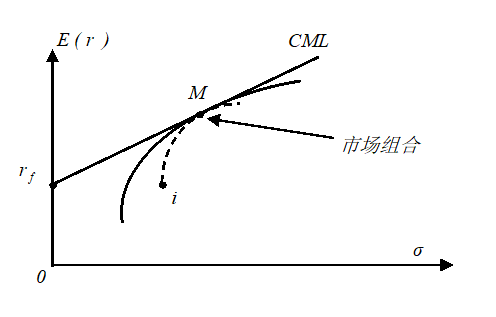

# 金融经济学 | 第6讲：资本资产定价模型（CAPM）（Ⅱ）

___

##  **1. CAPM的第二种论证**

###  **1.1 基于组合构建的CAPM论证**

现在，我们给出第二种推导CAPM定价方程的方法，这种方法不依赖于对效用函数的假设
  

令 $(\sigma_M,E(r_M))$ 代表市场组合 $M$ 。在均衡时，所有理性投资者所选择的投资组合都应该处在资本市场线（Capital Market Line, CML）上。CML的直线方程为

 $$E(r)=r_f+\frac{E(r_M)-r_f}{\sigma_M}\sigma $$

其中， $(\sigma,E(r))$ 是资本市场线上任意一种组合的期望回报率和期望波动标准差。我们可以用某一风险资产 $i$ 和市场组合 $M$ 构建出一个新的组合，并且假设这个新组合中的资产 $i$ 和市场组合 $M$ 的份额分别为 $w$ 和 $1-w$ 。我们将这个新组合的收益率记为 $r_w$ ，则

  $$\begin{aligned} E[r_w]&=wE(r_i)+(1-w)E(r_M)=w[E(r_i)-E(r_M)]+E(r_M)\\ \sigma(r_w)&=[w^2\sigma_i^2+(1-w)^2\sigma_M^2+2w(1-w)\sigma_{iM}]^{1/2}\\ &=[w^2\sigma_i^2+\sigma_M^2-2w\sigma_M^2+w^2\sigma_M^2-2w^2\sigma_{iM}+2w\sigma_{iM}]^{1/2}\\ &=[w^2(\sigma_i^2+\sigma_M^2-2\sigma_{iM})+2w(\sigma_{iM}-\sigma_M^2)+\sigma_M^2]^{1/2} \end{aligned} $$

当 $w$ 变化时，构建的组合在 $(\sigma,E(r))$ 为平面上为一条穿过 $(\sigma_M,E(r_M))$ 和 $(\sigma_i,E(r_i))$ 的曲线。当 $w=0$ 时，构建的组合就是市场组合 $M$ 。因此，这条曲线与资本市场线在 $(\sigma_M,E(r_M))$ 处相交。但是，这条线又不能高于资本市场线CML，否则意味着通过资产 $i$ 和市场组合 $M$ 构建的组合可以达到比资本市场线更优的均值方差组合，这与资本市场线的定义矛盾。因此，这条曲线只能与资本市场线相切于 $(\sigma_M,E(r_M))$ 处。

这意味着，曲线在这一点的斜率应等于资本市场线的斜率，即
$$\frac{dE(r_w)}{d\sigma(r_w)}\bigg|_{w=0}=\frac{E(r_M)-r_f}{\sigma_M} $$

又
 $$\frac{dE(r_w)}{d\sigma(r_w)}=\frac{dE(r_w)}{dw}\bigg/\frac{d\sigma(r_w)}{dw} $$

而
 $$\begin{aligned} \frac{dE(r_w)}{dw}&=E(r_i)-E(r_M)\\ \frac{d\sigma(r_w)}{dw}\bigg|_{w=0}&=\frac{1}{2}[w^2(\sigma_i^2+\sigma_M^2-2\sigma_{iM})+2w(\sigma_{iM}-\sigma_M^2)+\sigma_M^2]^{-1/2}[2w(\sigma_i^2+\sigma_M^2-2\sigma_{iM})+2(\sigma_{iM}-\sigma_M^2)]\bigg|_{w=0}\\ &=\frac{\sigma_{iM}-\sigma_M^2}{\sigma_M} \end{aligned} $$

因此，有
$$\begin{aligned} &\frac{E(r_i)-E(r_M)}{\frac{\sigma_{iM}-\sigma_M^2}{\sigma_M}}=\frac{E(r_M)-r_f}{\sigma_M}\\ \Rightarrow & \sigma_M^2E(r_i)-\sigma_M^2E(r_M)=\sigma_{iM}E(r_M)-\sigma_{iM}\cdot r_f-\sigma_M^2E(r_M)+\sigma_M^2\cdot r_f\\ \Rightarrow & \sigma_M^2[E(r_i)-r_f]=\sigma_{iM}[E(r_M)-r_f]\\ \Rightarrow & E(r_i)-r_f=\frac{\sigma_{iM}}{\sigma_M^2}[E(r_M)-r_f] \end{aligned} $$

定义 $\beta_i=\frac{\sigma_{iM}}{\sigma_M^2}$ ，那么有

 $$E(r_i)-r_f=\beta_i[E(r_M)-r_f] $$

即，我们得到了CAPM定价方程。

另外，我们尤其需要注意，CAPM只是在市场达到均衡时才成立。

___
###  **1.2 夏普比以及对第二种论证的说明**

我们来想想，在第二种推导中，我们究竟在做什么。简单来说，我们是在分析，是否可能通过将市场组合 $M$ 与其他资产组合起来，以获得高于市场组合的夏普比（Sharpe Ratio, SR）。

一项资产（或一个组合）的夏普比等于其风险溢价（期望回报率减去无风险利率）除以资产的波动标准差。对资产 $i$ 来说，其夏普比为
$$SR_i=\frac{E(r_i)-r_f}{\sigma_i} $$

夏普比衡量了通过承担更多风险（更大的波动率）来获得更高期望回报率的效率。夏普比越高的资产，承担同样的风险能获得更多的期望回报率上升。显然，投资者会偏好夏普比更高的资产（或组合）。

由于期望回报率 $E(r_i)$ 和期望的波动率 $\sigma(r_i)$ 都是无法观测的，所以在实际计算夏普比时是用过去的回报率均值和波动来代替的。因此，实务中所使用的夏普比表达式是

 $$SR_i=\frac{\bar{r}_i-r_f}{\sigma_i} $$

其中， $\bar{r}_i$ 与 $\sigma_i$ 是用回报率历史数据计算出来的。

在所有由风险资产所构成的组合中，市场组合 $M$ 有最高的夏普比。市场组合 $M$ 的夏普比就是资本市场线的斜率。而我们知道，资本市场线是所有穿过无风险资产和风险资产组合的直线中，斜率最大的那根线。而所有这些直线的斜率都是其穿过的风险资产（组合）的夏普比。

显然，所有投资者都会偏好于夏普比更高的资产，也会尽力去持有这样的资产。当市场达到均衡时，所有投资者应该都已经穷尽了所有手段，找到了自己能够找到的最高夏普比的资产。由于均衡时所有投资者都持有市场组合（均值方差分析的结论），所以市场组合理应是市场中夏普比最高的资产。因此，将市场组合与其他任意一种资产再做组合，一定无法得到更高的夏普比，否则市场就不在均衡中了。这样，我们也就推导出了均衡时资产价格之间的关系——CAPM的定价方程。

___

##  **2. 证券市场线 vs. 资本市场线**

CAPM表明不同资产的期望回报率之间存在线性关系： $\beta$ 越大的资产，期望回报率应该越高。理论上，如果以 $\beta$ 为横坐标，资本期望回报率为纵坐标，那么根据CAPM定价方程得到的直线为证券市场线（Securities Market Line, SML）。

注意，资本市场线（CML）是在波动率-期望收益坐标系上的直线，表示由无风险资产和市场组合再组合之后能够实现的收益风险特性；而证券市场线（SML）则是在 $\beta$ \-期望收益坐标系上的直线，表征的是不同资产的期望收益率随 $\beta$ 变化而做线性变化的规律。

证券市场线（SML）：
 $$E(r_i)=r_f+\beta_i[E(r_M)-r_f] $$

资本市场线（CML）：

 $$E(r_i)=r_f+\frac{\sigma_i}{\sigma_M}[E(r_M)-r_f] $$
  

上述两个式子都具有类似的形式，都是把资产的期望回报率表示成两部分：
 $$期望收益率=资金的时间价值（无风险利率）+ 风险溢价 $$

而
 $$风险溢价=风险的度量\times 风险的价格 $$

两个方程的差别在于，在SML中，风险以 $\beta$ 度量，风险的价格为 $E(r_M)-r_f$ ；而在CML中，风险以 $\sigma_i$ 衡量（资产的标准差衡量风险），风险的价格为 $\frac{E(r_M)-r_f}{\sigma_M}$ 。

两个方程均成立，但是它们适用的对象不一样。SML对所有资产都成立，而CML只对那些由所有资产（包括无风险资产及风险资产）组合起来的“有效组合”成立。即，SML是一条对所有资产都成立的定价方程，而CML只是用来描述有效投资组合的“辅助线”，CML是SML的特例。

  

图2直观地为我们展示了SML与CML之间的区别。A、B、C、D四项风险资产不一定会处在CML上，但是它们一定会处在SML上。

___

 **参考文献：** 《金融经济学二十五讲》. 徐高. 中国人民大学出版社. 2018-7

<iframe src="https://player.bilibili.com/player.html?isOutside=true&aid=113530078496060&bvid=BV1fgByYtEfc&cid=26924286378&p=33&autoplay=false" scrolling="no" border="0" frameborder="no" framespacing="0" allowfullscreen="true"></iframe>