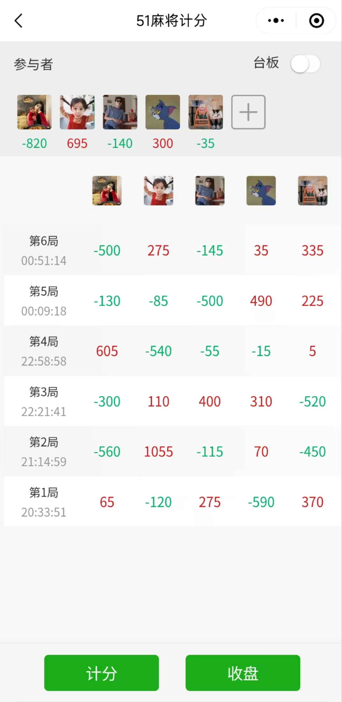
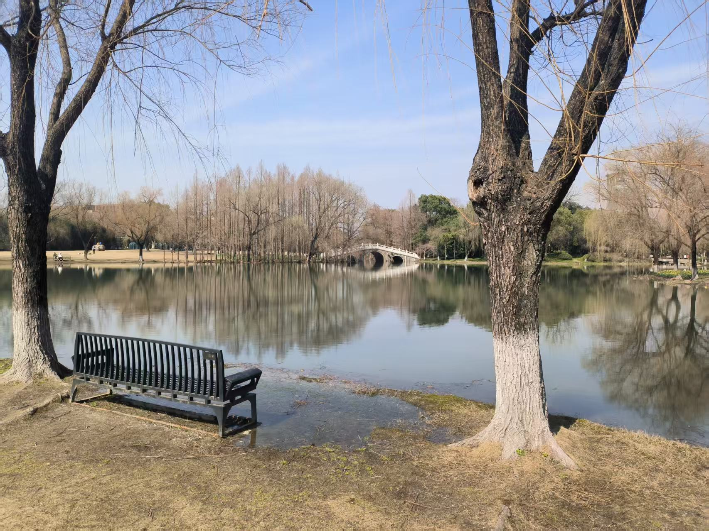
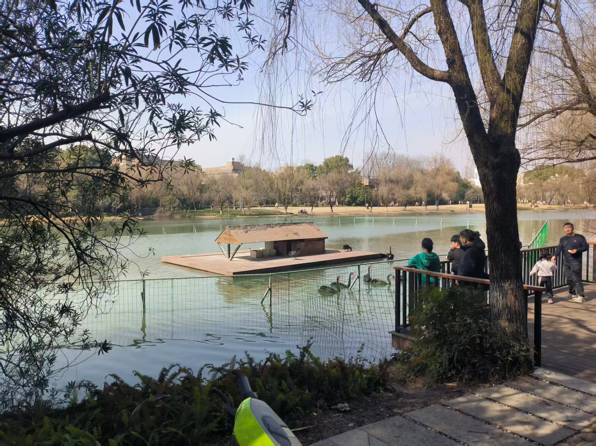
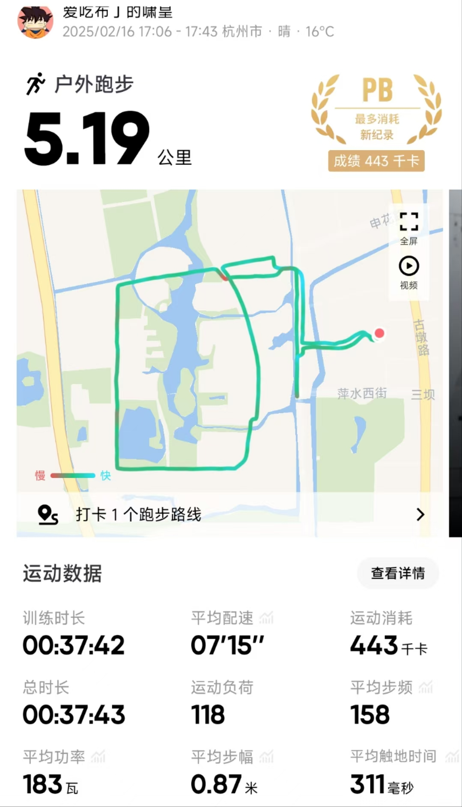
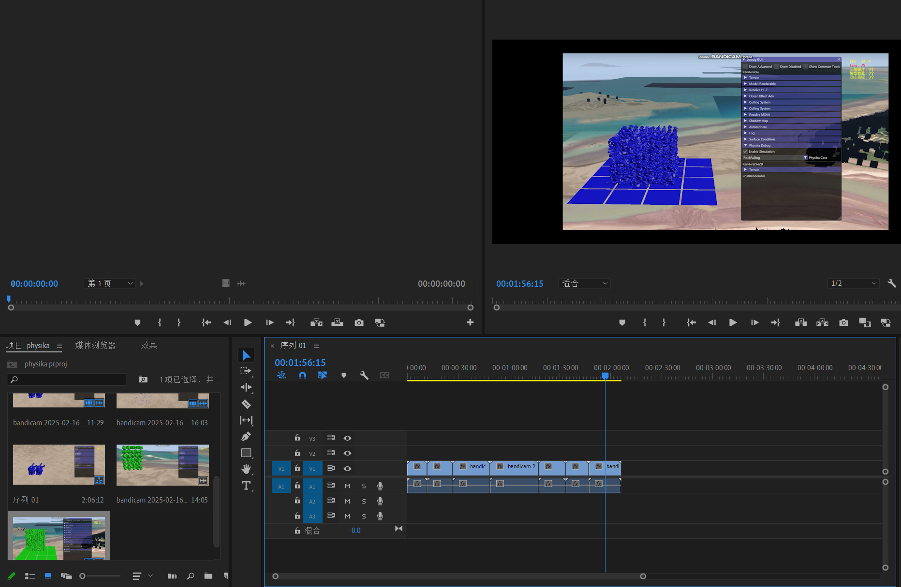
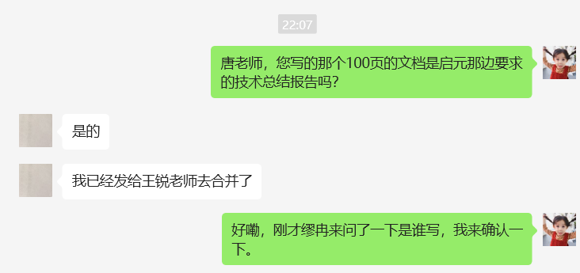

## Part 1

凌晨和小洋同学还有研究生同学小威去炸了金花，侥幸拿了mvp。很喜欢对局中观察对方表情，猜他底牌大小的感觉，同样也喜欢被对方看穿，猛猛输钱的感觉。特别想猛猛输钱给小璇同学。
## Part 2
后面和小威同学单独走，不知道咋的聊到他之前分手四个月的女朋友，他分析分手的原因：他和她在一起的时候是一直非常开心的，但是她和他在一起的时候有时是开心的，有时是不开心的，但是她不开心她不会说出来，所以最后就聚少成多，导致了分手。我听着他的倾诉，不知不觉哼起了《倒带》：

小威同学说“你妈的，我下午刚听的这首歌”，然后眼泪哗哗的流，根本止不住。我站在旁边拍了张他流泪的照片，这不是他第一次在我面前哭，但这次是晚上，白色的路灯照在他的脸上，我第一次如此清晰的看到他脸上闪烁的泪痕。我试图劝说他不要看重结果，多在意过程，但是他和我解释了他为什么如此看重结果，说着说着出租车来了。我看着他上了车，关了门，车子缓缓的启动，加速，直到消失在我的视野之中。

## Part 3
早上11点醒来，磨叽了一个小时(看了看签证攻略)去和小洋同学去食堂吃午饭，小洋同学和我说：昨天他对象的几个行为让他觉得她不是真的喜欢她，叽里咕噜和我说了一大堆。我说他纯在瞎猜，让他别想太多，他拎着我去校园里走了一圈，这场午间散步我俩都有所收获，他得到了倾诉的快乐，我收获了校园的冬日美景。

## Part 4
回到寝室后和77bond还有aboje打守望先锋，我说LUNA人呢，aboje说去她看哪吒了。他还说他之前请他爸爸妈妈七大姑八老爷啥的一起去看哪吒了。我的脑海中一时很难脑补出他刚才描述的场面，只能对他说：你真是个天才。

## Part 5
5点左右，我出门跑了趟步，战绩如下
对比上次跑步提升了不少。跑的时候穿着毛衣和长裤，导致猛猛冒汗，以后就不穿这么多了，直接短裤短袖走起。很想和小璇同学一起跑步。

## Part 6
8点开始给老唐干活，写他一手文档，做一个测试的演示视频，顺便学一手软件pr，之前做的mv质量实在丢人。

有一个项目的时间达不到标准，还要考验老夫的ps技术啊，直接给它 P 成达标的。
10点竣工，嗨心！还好这个100页的文档不要我写。

## Part 7
10点左右开始写这个文档。

今天看到一个视频，短短34秒，前面25秒都在吹牛逼，后面9秒才真正开始：

<iframe src="https://player.bilibili.com/player.html?isOutside=true&aid=113954810499659&bvid=BV16cNEeXE1n&cid=28238021394&p=1&autoplay=false" scrolling="no" border="0" frameborder="no" framespacing="0" allowfullscreen="true"></iframe>

里面两个点，一个我之前从没有考虑过，一个是我之前就意识到我有这个问题，但是现在还在努力解决的问题。

1.管理好留给自己的时间，留给生活的时间，留给朋友的时间

2.不会的马上向人请教，不懂的马上去找答案

第一点我从来没考虑过，今天一算，在朋友身上花掉了6个小时，而且还是在没给小璇同学花时间的情况下，感觉这段时间的占比太多了，需要好好调整一下，明天再来测。

第2点的之前就知道，一直在改，老唐也指出过我有这个毛病，下达任务一直拖到ddl，现在改了一些，但是感觉动作还是不够迅速。

听了一首古巨基红馆唱的爱与诚，感觉现场版的更强啊！！！

<iframe src="https://player.bilibili.com/player.html?isOutside=true&aid=288579205&bvid=BV1Gf4y1y771&cid=279815985&p=1&autoplay=0" scrolling="no" border="0" frameborder="no" framespacing="0" allowfullscreen="true"></iframe>

音色太好了，还有穿透力，顿挫感，听的太爽了。