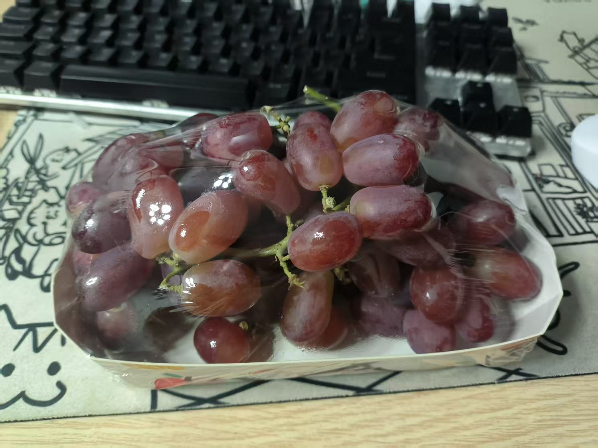

## Part 1

早上8点半睁开双眼，起来猛猛写文档，还有给视频去了个水印，物理去水印大法，直接把水印截图扣掉，感觉自己pr技术越来越高了。

## Part 2

中午和阿璇一起玩了会儿守望，小洋同学中途进来玩了会儿，不过后面他很快就退出了，因为他的电脑被他对象远程操控了，哈哈。小洋同学的对象最近在改毕业论文，她的老师不让她送审，所以一直拿着小洋同学的两台4090跑深度学习，不过吃晚饭的时候她老师同意她送审了。明天国服就回来了，但是我可能要去学校给唐老师整一整我的答辩表，让他老人家给我签个字。

## Part 3

下午去练了三个小时的歌，感觉需要调整出气的力度，在某些关键字上面加大吐气，在一些字上面要虚一点，这样听起来有对比感，如果一句话一直用很强的气去顶，那么听起来就像一个调，没有对比感。还有就是高音到低音，低音到高音的过渡，要缓慢的打开或者关闭头腔，不然很容易用嗓子唱。真想唱好听给阿璇唱啊。

## Part 4

吃晚饭的时候和阿璇讨论了下mbti，我去搜了下关于intj的特点，结果搜到了下面这玩意儿。

拜托，我也是 intj 好嘛？

## Part 5

今天没有出去跑步，因为大腿很酸，屁股有点疼，感觉跑步的时候大腿在顶着屁股一直摩擦。和长跑大神小洋同学讲了以后，他说这说明跑步的姿势是对的，并且他让我疼的时候也要多走走，就像按摩的时候按的地方很疼，我走路就是给屁股按摩。我将信将疑的跟着他走了一路，我觉得没什么道理。在食堂吃了鸡腿饭还整了和红提回去，这几天晚上老是饿，今晚饿就吃吃红提。

## Part 6

分享下今天的感想小视频吧，易中天老师这段话，我听他前面讲的非常常规，对人为什么活着做出了老生常谈的回答，过好每一天，但是不会有人告诉你怎么过好每一天。庄子对这个问题的回答是，真实而自由的活着，这其实挺触动我的，总结性非常高。我希望我能真实而自由的活着，同样也希望阿璇也能真实而自由的活着。

<iframe src="https://player.bilibili.com/player.html?isOutside=true&aid=113492212319025&bvid=BV1oZUhY5EVG&cid=26790593094&p=1&autoplay=false" scrolling="no" border="0" frameborder="no" framespacing="0" allowfullscreen="true"></iframe>

