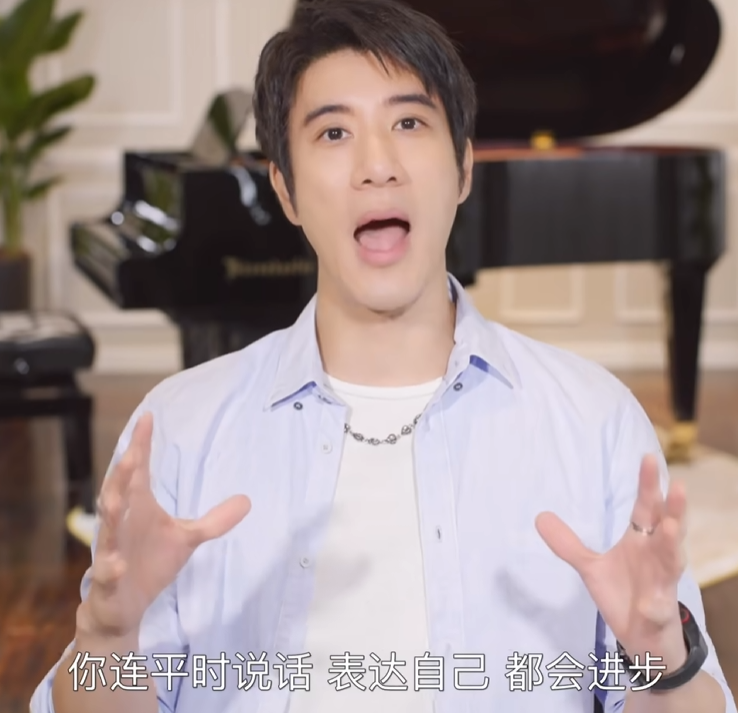
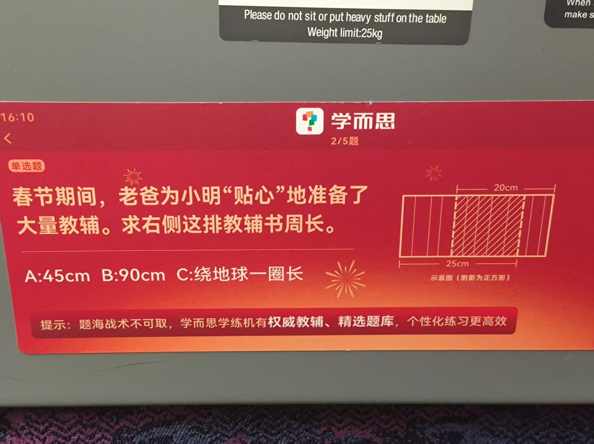

## Part 1

今天去找一个合唱团的同学唱歌了，感觉自己的发声方式问题很大，我自我感觉发声方式是一种习惯，有了良好的发声方式，就可以用最少的气唱出对应的音，节约气的同时嗓子还放松。今天唱的时候，前一个半小时我都在找胸腔共鸣还有头腔共鸣的状态，非常痛苦，高音上不去，还很累，纯的用嗓子唱。我总结为发声方式有大问题，所以我的朋友建议我去多做练声训练，没事就哼鸣爬音阶，所以我去网上找了找力宏歌的教程，开看！

<iframe src="https://player.bilibili.com/player.html?isOutside=true&aid=113407386715891&bvid=BV1KTSRYhEag&cid=26576489151&p=1&autoplay=false" scrolling="no" border="0" frameborder="no" framespacing="0" allowfullscreen="true"></iframe>

我勒个二哥啊，这么吹牛逼嘛？人声的蜕变，就是人生的蜕变！！！

强调：必须要做课程里面所有的练习和功课。锻炼唱歌的肌肉，六天训练，一天给肌肉恢复。随时随地做声乐练习。

学习唱歌第一步：正确的呼吸。 正确呼吸的第一步：放松。

## Part 2

今天和几个同门去宁波报道了，舟车劳顿的，没啥有趣的事情发生，唯一的爽点是吃了一顿寿喜烧自助牛肉羊肉火锅，吃到最后看到肉都晕乎乎的。
在会杭州的高铁上，我看到了一个世纪难题

这个题好像有点难度，我感觉要用排除法选A。但是45咋算的我真不知道。