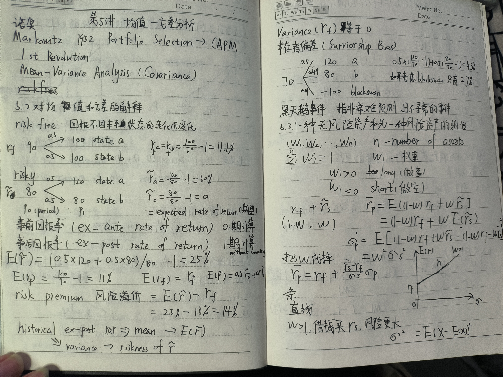
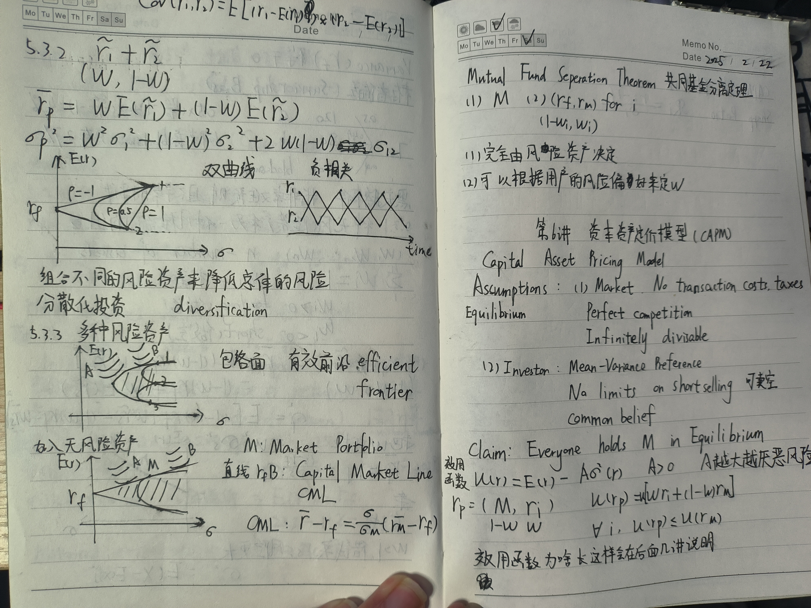
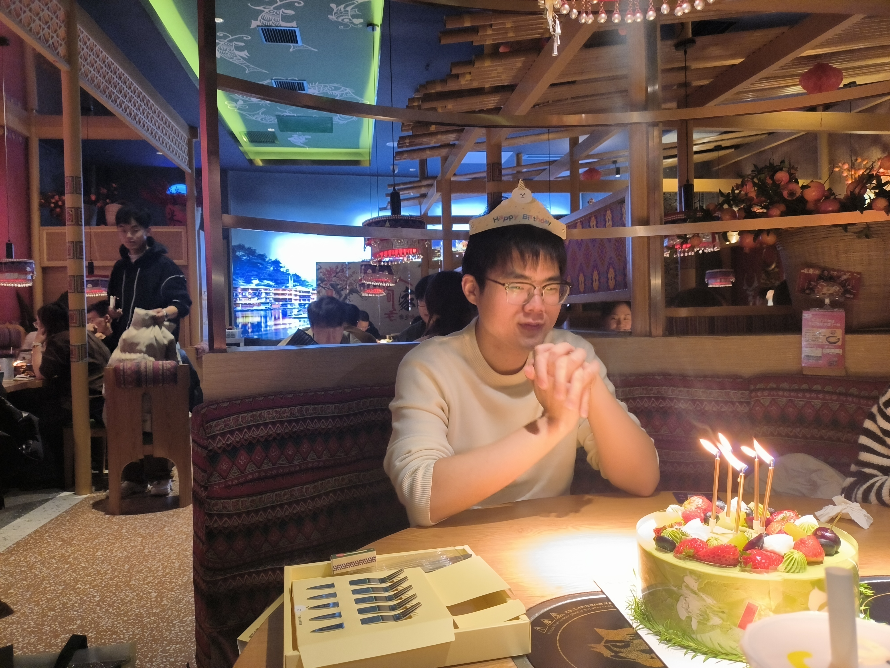

## Part 1

昨晚上9点50直接睡觉，早上7点20醒的，起来以后先看了徐高的微观经济学，主要是capm的前置知识，一些风险资产的组合。

## Part 2
然后看了罗老师的讲解理想国，第三章上册。他提出了一些我从来没思考过的观点，即音乐教育，艺术教育对正义的作用。拿我自己举例子，我喜欢听陈奕迅的歌，那陈奕迅的歌里面确实都是伤感的，得不到也无所谓的歌。柏拉图在书里面把一些悲观的歌称为靡靡之音，这种歌会阻碍人的进步，阻碍人去追求正义。也许我应该换一些歌手去听？我感觉我二哥的歌就不错欸，听他的《天地龙鳞》还有《改变自己》，应该是挺积极的吧。

还有柏拉图也同样主张爱应该克制，所以我之前说的那些皮一点是不可取的，要认真对待。

## Part 3

小余的生日。

今天晚上陪小余玩了德扑，有点晚了，就写这么多吧。