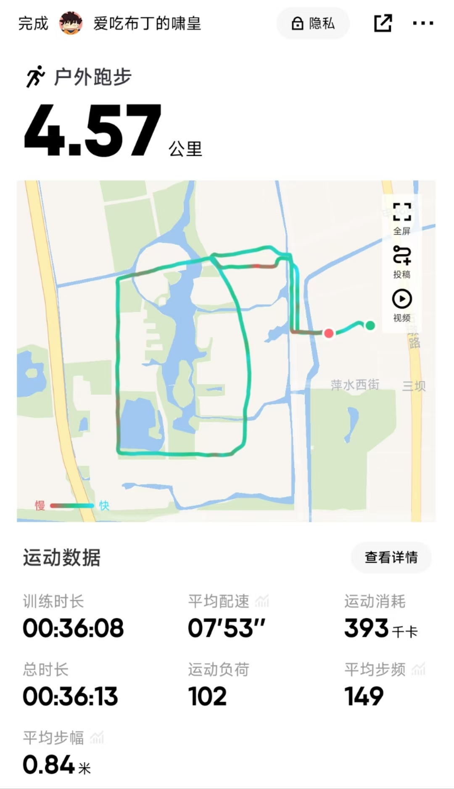

## Part 1

早起学习铁拳！

mzm小课堂铁拳教学：

1.在叫e和右键之前要想好撤退的掩体。

2.等技能，两个位移技能必须要几乎都在的时候才能进入战场。一般e技能可能会在空中飞1s，右键也可能会蓄力1s，所以可以提前1s进入战场。

3.卡住掩体蓄力右键，最好是一开始视野完全被掩体挡住，然后蓄力缓慢拉出来，看到有人就锤上去，没人就回来。

<iframe src="https://player.bilibili.com/player.html?isOutside=true&aid=113984053186840&bvid=BV1NyNie7Ef2&cid=28331409518&p=1&autoplay=false" scrolling="no" border="0" frameborder="no" framespacing="0" allowfullscreen="true"></iframe>

## Part 2

今天又和子璇玩了6个小时守望，和两位小余同学来了一波超多连胜， 大家都在猛猛上分，下次去美服玩玩，感觉小璇同学顶着高延迟打有点痛苦。

打完守望去跑步了，当时已经6点，没吃饭去跑，天还挺冷的，直接给我冻的难以呼吸，跑着跑着就感觉自己顶不住了，拉跨了。

## Part 3

今天的重头戏是和捞灿同学聊了1个多小时的语音，我和他讲了一些我最近的想法。

首先是p人和j人的事情，我说感觉j比较好，p太随性了，容易不自律。但是捞灿说自律是和p，j无关的，甚至p因为有激情可以提供更高的工作效率，比如有天晚上11点，你写代码很有感觉，正是才思泉涌之时。但是这时候你的规划告诉你：到点了，是睡觉的时间了。于是j人选择上床睡觉，但是p人选择了继续高效的工作，尽管作息一直是乱的，但是他们可能有更高的效率。并且他表示他觉得自律和p，j无关，并不是你规划好自己的时间就能自律的，有些人规划时间很好，但是他规划学一个小时，但是有半个小时是在发呆。因为人的感觉是一阵一阵的。

其次，我和他讲了音乐的事情，他觉得我讲的很有意思。就是有些歌我听了就觉得很低沉，听完就没有斗志了，不想继续坚持了。有些歌就能催人奋进。但是捞灿表示，并不是因为你听了歌才不自律的，是因为你本身就不自律，那些歌只是在你学习的时候触动了你那本就不自律的基因，然后你就中道崩殂了。所以你需要改掉的是你自身的不自律，但是你是可以通过改变歌单来避免触发不自律的因素的。并且捞灿让我不要和别人分享音乐，因为没有相同的经历就很难代入。他带着我听了两首歌，我确实听了没啥感觉，他说他打魂类游戏的时候听这种就很有感觉。

到底怎么提高自律啊，他么的能不能抢救一下？

## Part 4

俯卧撑只能做14个了，脸都撑红了。

