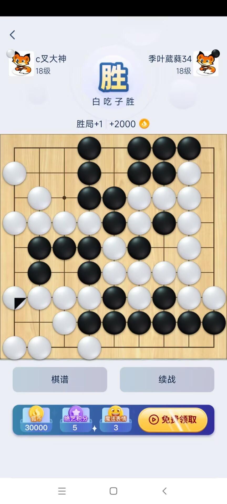
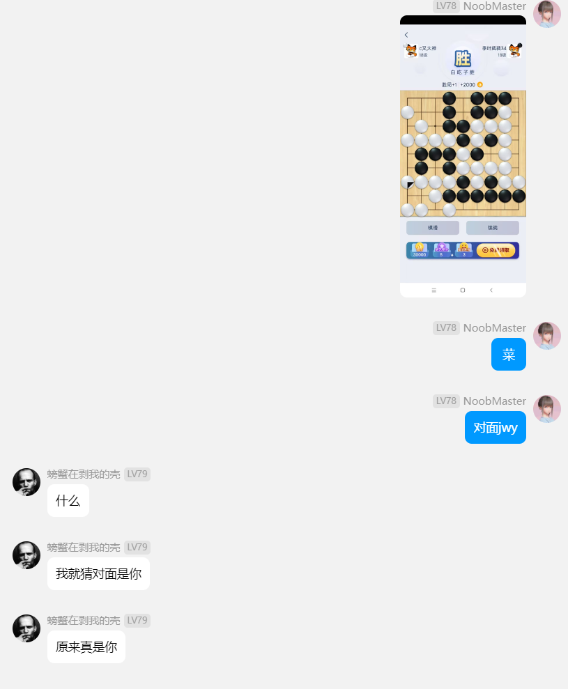
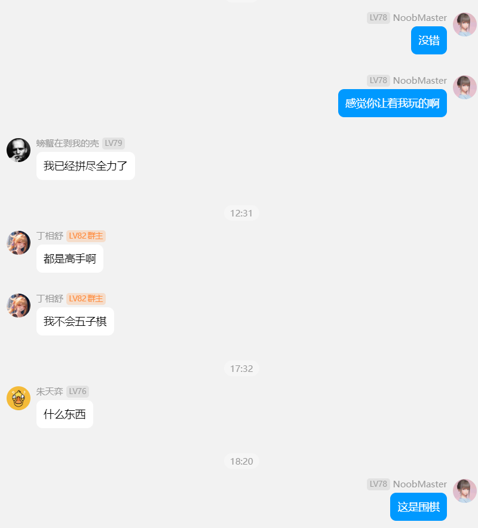

这几天断更了，原因是感冒加上答辩，所幸答辩顺利通过了。之前阿伟说脱单以后会有一连串好事降临，还果真如此。也许我内心充满了幸福，所以身边的所有事情都被我染上了幸福的颜色。‘

## 游戏

下午和阿璇打了一会儿守望，以后尽量不喊我的朋友一起来玩守望了，因为我感觉有其他人在，阿璇的笑声会变少，然后她会打出更多大胆的操作。

其实她今天说出：”小月亮上线了“的时候，我的大脑疯狂运转，到底要不要拉她，她的意思是我拉还是不拉，我呃了一段时间还是拉了。不过阿璇的声音就变少了。

下次再拉我是狗。

## 健身

时隔半年，我又去健身了，感觉我潜移默化的在被阿璇改变。今天的健身房就我一个人毛衣毛裤，简直不是人。

其实我出门的时候有犹豫过要不要穿毛衣，但是我又害怕感冒加剧，就本着宁可热着，不要冻着的精神，直接全副武装了。在健身房差点没给我热死。

今日卧推极限45kg，做了5个，很有感觉。40kg做了三组，每组8个。

深蹲50kg，做了三组，每组8个，感觉有点喘不过气来。

引体做了极限57kg，做了8个，很有感觉，50kg做了两组，每组8个。

夹胸也做了2组，多种我有点忘了，也没冲击极限。

## 答辩

答辩的时候，全程被喷，有个老师说你致谢写的挺好的呀，但是你的正文为什么不这么认真的去写？这事儿挺有意思的，但是想成为什么样的人和成为什么样的人是有距离的，就是理想和现实的距离。

下面是我的致谢：

闲云潭影日悠悠，物换星移几度秋。不知不觉，来到浙大已近三个春秋，我与浙大同行的路也快到了尽头。

遥想入学当年，懵懂无知，尼采在书中说人生有三个阶段，骆驼，狮子和婴儿，我当时大抵是个骆驼。

在父母和同龄人的影响下，我不断学习课本的知识，考出像样的成绩，顺利成为了浙大的研究生。开学时的我无知的骄傲着，却从来没有思考过为什么要学习，为什么要活着，进一步也就引入了一个终身思考的问题，人生的意义是什么。

首先，我要感谢浙大的竺可桢老校长的两问：第一，来到浙大来做什么？第二，将来毕业后要做什么样的人？这两个问题把我从骆驼阶段揪了出来，扔进了狮子阶段。

我想，我的整个研究生生涯一直在思考这两个问题。也许这两个问题本没有标准答案，但在和浙大人相处的过程中，我逐渐找到了属于我的那份答案。

接着，我要感谢我的导师唐敏教授，他的言行举止，给了我很大的影响，在我找寻答案的路上，他是一盏明灯。他不是一个严肃的教授，也许可以用慈祥来形容他，有时我觉得他非常不真实，不像是存在于现实中的这么一号人物。他工作勤劳，起早贪黑，这点是我从他微信回复消息的时间总结到的。他任劳任怨，即使是脏活累活他也一力承担，而且自得其乐，仿佛在他眼里工作没有简单和复杂之分。

他为学生着想，不强迫学生做不喜欢的项目。这也给了我大量闲暇的时间，去寻找自己人生的意义。我常常思考怎么才能成为他这样的人，我突然发现我好像找到了竺老第二个问题的答案，是的，成为像唐老师一样的人。

想要成为什么样的人和能不能成为是两回事，很多时候人们空有理想却无法实现。在我的研究生生涯中，我度过了一段昼夜颠倒的日子，每晚睡觉前都自感惭愧，我意识到，自己失去了自驱力。

赫尔曼黑塞在悉达多一书中，同样描绘了相似的故事。从小被父母培养的很高尚的小婆罗门，在主动离开父母，自己寻求人生的意义的过程中，陷入了纸醉金迷之中，甚至染上了赌博等恶习。一个完全自由的人是很容易迷失自我的，所以古人常说要慎独。

我浑浑噩噩的过了一段时间，期间看了哲学方面的课程，期望从中找到自驱的答案。但是我没找到，反而是在一段和经济制度相关的讲座中，我找到了答案。

在西方国家，股民把钱投资给信托经理，信托经理往往是比较有能力的人，他们需要做到对股民诚信，一旦发现有欺骗行为，那么政府会其施行非常严厉的惩罚。所以有能力的精英们就带着人民一起赚钱，国家也就此富强起来。中国也引进了相关的制度，但是近年来却出现了大量的走资问题，原因就在于信托经理把赚到的钱放进了自己的腰包，然后让人民为他还债。

我想，其实父母和老师在我身上也投资了很多东西，在某种意义上，我就是一个信托经理，如果我持续低迷，那么其实和走资派一样都是自私的人。

我想成为一个对股民负责的信托经理，这个观念使我逐渐自律起来。所以我要感谢我的父母和老师，谢谢他们在我身上的投资。

感谢实验室的其他老师：童若锋，杜鹏老师等，他们广博的学识和清晰的逻辑潜移默化着我。

同时，我还要感谢在浙大一起奋斗的战友们：王威，许青春，俞子轩，陈博文，张尧，吴月锋，陈宝润，叶力，张军锋，管筠箫，张晨，康佳成，徐磊，李懿帆，范逢霄，吕泽源，张振虎等同门。在实验室就像在幼儿园一样，是童年的我们才可以无忧无虑,还是无忧无虑的时光叫做童年？

感谢实验室的学长学姐们：王彤彤，王鑫磊，陈潇瑞，蒋迪琼，李玉迪，樊鹏，杨赟，严炳锐，张逸凌等。他们给与了我学术上的帮助和代码上的指导。

感谢校外的志同道合的伙伴：缪冉，魏克铭，徐奔，张迪飏，裴鑫铭，文子铭，陈若言等。和他们一起进行了愉快的合作。

感谢我的伴侣卢子璇，一直在默默支持帮助我。

感谢本文的指导老师，评审老师，虽然素未谋面，但是感谢你们拿出生命中宝贵的时间与我共享，助我进步。

现在想来要与浙大分别，仍旧有些不舍。也罢，独自莫凭栏，无限江山，别时容易见时难。流水落花春去也，天上人间！

## 围棋

今天搞了把9x9的围棋，小赢。我把截图放到了群里，结果有人说他不会下五子棋。。。

有机会把这几个群友介绍给阿璇认识。

