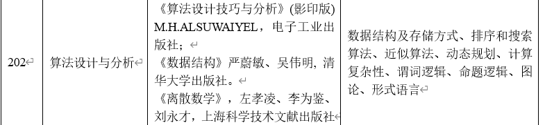
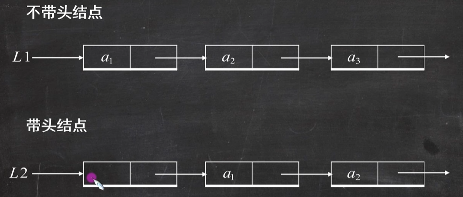
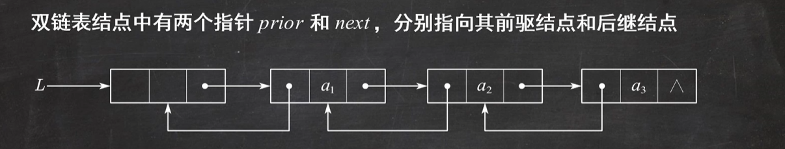
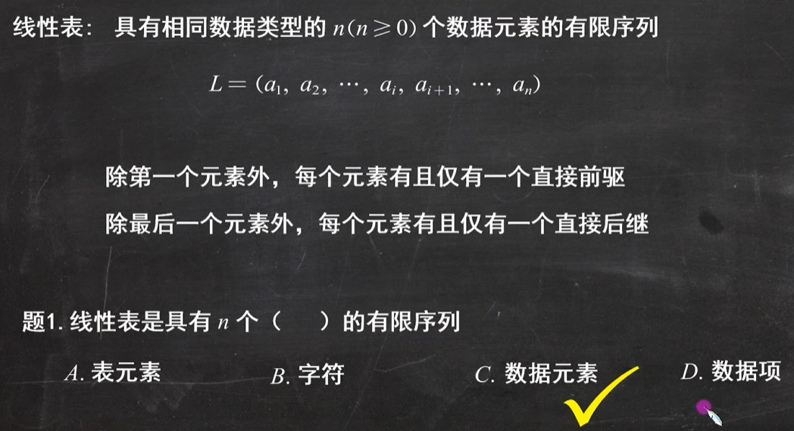
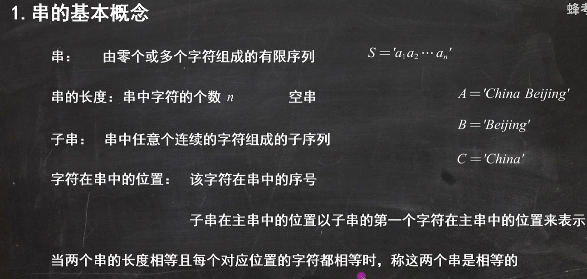

考博科目：



## 数据结构

### 链表
区分头结点，头结点里面不存东西。 头结点是为了运算方便的实现，有了头结点就不需要区分头结点和后续结点了。





主要考察增删查改
```cpp title:node
template <class T>
struct Node{
	Node* next;
	Node* prior;
	T* element;
};
```

### 线性表



线性表占用连续内存空间

```cpp title:list
#define MaxSize 50
template <class T>
struct List{
	T element[MaxSize];
	int size;
};
```

存储密度高，只存储数据，不用存指针。

### 栈和队列

一般使用队列来存储栈和队列。

```cpp title:
template <class T>
struct stack{
	T element[MaxSize];
	int top;  //记录栈顶元素位置
};

template <class T>
struct queue{
	T element[MaxSize];
	int front,rear;  //记录头尾元素位置
};
```

### 串



```cpp title:小写字母改成大写字母
#include <iostream>
using namespace std;

int main()
{
	char ch='\0';
	cout<<"请输入一个字符：";
	cin>>ch;
	if(ch>='a' && ch<='z')
		ch=ch-('a'-'A');
	else if(ch>='A' && ch<='Z')
		ch=ch+('a'-'A');
	cout<<"ch = "<<ch<<endl;
}
```

