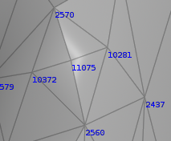
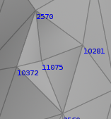
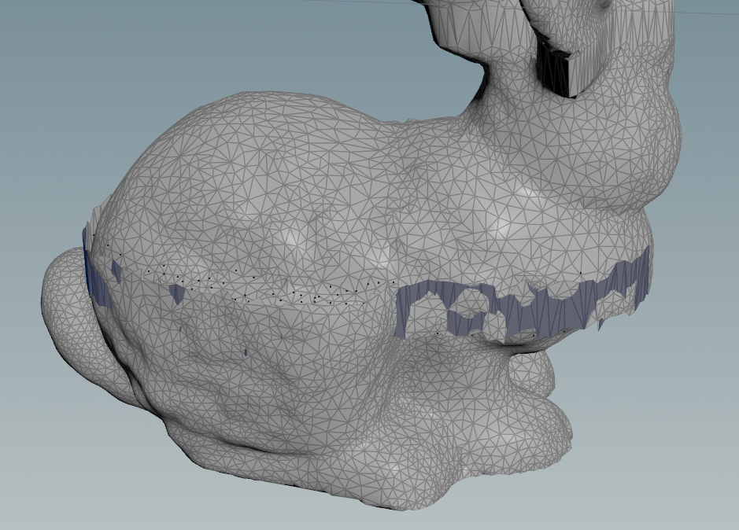

写有限元出现了一些bug。

去掉重力纯用有限元，可以发现物体无法静止。

前后两帧对比如下。

houdini的点从0开始标号，所以对应的索引是(10282, 2561, 11076, 10373)和(10282, 11076, 2571, 10373)单独将这个四面体拎出来研究。

查到bug ： D4Index没有将四面体索引copy进来，copy进来以后，简单的四面体可以稳定

兔子从中间裂开了，上下两部分都没问题，就是某些部位断裂开来，感觉是某些核函数的线程数没搞对。
