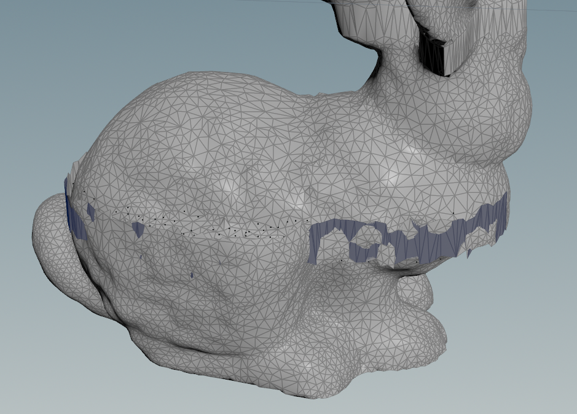

坏，调试了半天发现一个核函数没有输出，后面发现是debug模式下没有cudaThreadSynchronize();这会导致程序还没来得即输出就中止了。

吐血了，这个3x3的矩阵和一个常数相乘我的外循环写成9了，鬼屎ai。

思考出了一个可能的答案

这个兔子是在xy平面下面的，所以越上面的顶点z轴数值越小。在做a = b-c的时候，b和c的数量级越小，越不容易出现浮点误差。我把兔子挪到平面上面，如果兔子的下半部分向下掉落，则推理正确。

果不其然！

上面的bug修完就可以自然下落了，但是速度一快就会出现这种尖刺，怀疑两种可能：1.一次牛顿法无法收敛，速度快了会加强非线性？ 2.PCG求解有问题。 但是我估计应该是某些地方出现了浮点误差

刚度调小了就能收敛了，时间步长调小也能收敛，需要思考思考。

这两项都会使得非线性变大，从而导致线性方程组无法收敛？但是线性方程组如果矩阵是正定的不就应该能收敛吗，但是我目前做实验下来发现它并没有在收敛。
