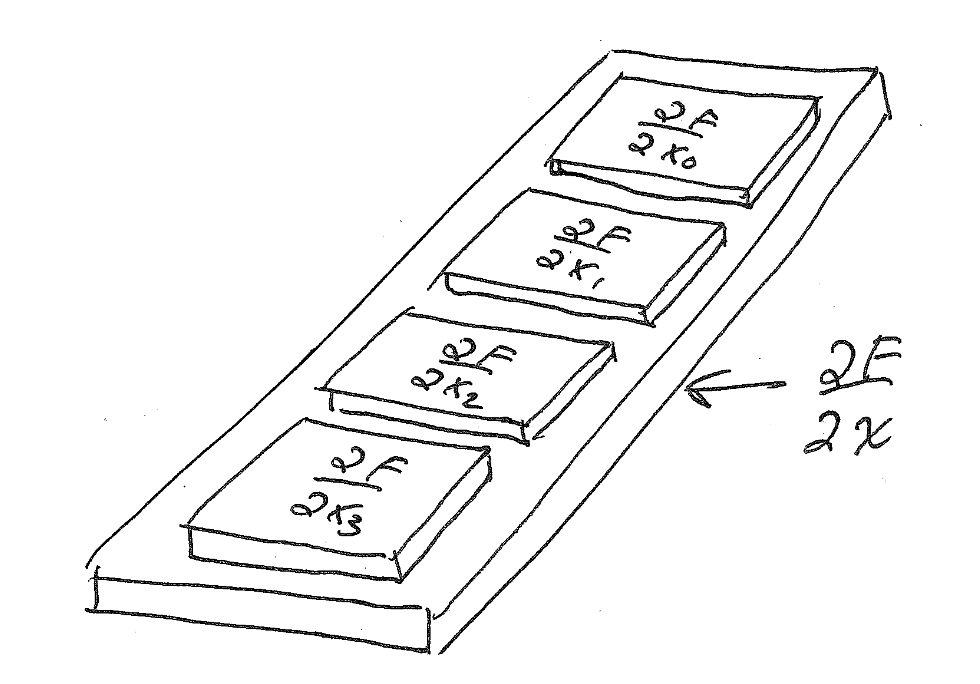

## 赛尔号！

和阿璇激情讨论赛尔号

有一说一她的背包里面，精灵都好厉害。我半夜还爬起来打开我的背包看了看，真是一坨

她买了一包糖，但是这个糖的目的是用来治疗过敏，说实话闻所未闻，简直是天才，感觉包装纸上的笑脸是在笑她天真。

## ARAP数学推导
为了搞定正定性的问题，首先我要复习一下ARAP这个模型的数学推导过程

对形变梯度矩阵进行极分解
$$
F = RS
$$
ARAP的定义如下
$$
\begin{aligned}
\Psi_{\text{ARAP}} &= \| \mathbf{F} - \mathbf{R} \|_F^2 \\
&= \| \mathbf{F} \|_F^2 + \| \mathbf{R} \|_F^2 - 2 \, \text{tr}(\mathbf{F}^T \mathbf{R}) \\
&= \| \mathbf{F} \|_F^2 + 9 - 2 \, \text{tr}(\mathbf{S}).
\end{aligned}
$$
它是形变梯度的二阶项，而stvk是四阶项，所以它的非线性弱于stvk。这个公式里的9哪里来的？

求力，也就是能量一阶导
$$
\frac{\partial \Psi}{\partial x} = \frac{\partial \Psi}{\partial F} \frac{\partial F}{\partial x}
$$
其中，形变梯度对位置的导数可以表达为12个矩阵组成的向量，12x3x3，然后能量对形变梯度的导数是3x3。
The matrix $\frac{\partial \Psi}{\partial F}$ is also known as the **first Piola-Kirchhoff stress tensor**

PK1公式如下
$$
P_{\text{ARAP}}(\mathbf{F}) = \mu(\mathbf{F} - \mathbf{R})
$$
下面几个公式抄下来方便复习，推导中用到

$$
\begin{aligned}
\frac{\partial I_1}{\partial \mathbf{F}} 
    &= \frac{\partial \operatorname{tr}(\mathbf{S})}{\partial \mathbf{F}} 
    = \mathbf{R}, \\
\frac{\partial I_2}{\partial \mathbf{F}} 
    &= \frac{\partial I_{\mathbf{C}}}{\partial \mathbf{F}} 
    = \frac{\partial \|\mathbf{F}\|_F^2}{\partial \mathbf{F}} 
    = 2\mathbf{F}, \\
\frac{\partial II_{\mathbf{C}}}{\partial \mathbf{F}} 
    &= \frac{\partial \|\mathbf{F}^T \mathbf{F}\|_F^2}{\partial \mathbf{F}} 
    = 4\mathbf{F} \mathbf{F}^T \mathbf{F}, \\
\frac{\partial \|\mathbf{R}\|_F^2}{\partial \mathbf{F}} 
    &= \frac{\partial \operatorname{tr}\left(\mathbf{R}^T \mathbf{R}\right)}{\partial \mathbf{F}} 
    = \frac{\partial \operatorname{tr}(\mathbf{I})}{\partial \mathbf{F}} 
    = \mathbf{0}.
\end{aligned}
$$
hessian矩阵计算公式：
$$
\frac{\partial^2 \Psi}{\partial \mathbf{x}^2} 
= \frac{\partial \mathbf{F}^T}{\partial \mathbf{x}} 
\frac{\partial^2 \Psi}{\partial \mathbf{F}^2} 
\frac{\partial \mathbf{F}}{\partial \mathbf{x}}
$$

看完推导感觉我的ARAP的一阶导数和二阶导数算的没问题呀

## 实验验证
找了个简单的case，单个四面体，仍然会出现pcg无法收敛的情况，来一探究竟。
我将12x12的矩阵导出到python中用numpy求解了一下，发现有解，但是用我的pcg却无法收敛，也就是说我的pcg出现了问题！
详细处理pcg的bug。

