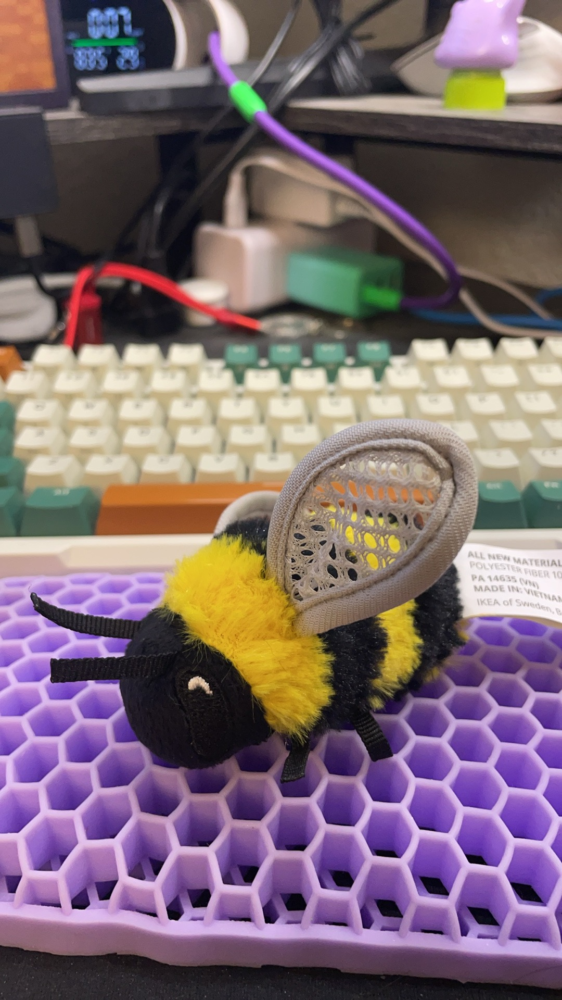

## 阿璇的聊天指南

她今天去逛了枪店  so coooooool ！！！

她说这个丸子很好吃 确实看起来好香啊

还有这个小蜜蜂，花2dollar买的 她觉得小蜜蜂很可爱 以后买礼物多搞点娃娃 嘿嘿 太好搞定了

## PCG debug
历经千辛万苦，终于找到了bug
$$
\mathbf{p}_{k+1} = \mathbf{z}_{k+1} + \beta_k \mathbf{p}_k
$$
我写成了
$$
\mathbf{z}_{k+1} = \mathbf{z}_{k+1} + \beta_k \mathbf{p}_k
$$
鬼屎，加错地方了，修改完bug后问题得到解决，大时间步长和高的刚度都能解了。

## 固定点添加

固定点实际上就是添加一个弹簧约束，但是这个是单个顶点的，所以只会用到一个顶点的约束，所以只涉及到3x3矩阵的计算

已经搞定！但是我看ARAP基本上没有bending项，就是剪切方向的抵抗。还有一种可能是我的时间步长太大了，一次牛顿法远远不够，线性方程组收敛了，但是非线性没有收敛。

## IPC论文推导

里面有个kappa的推导我没看懂，kappa的选值和d_hat的选值有关，我要多看看gipc的代码找找灵感

