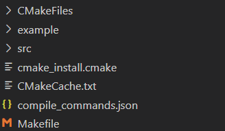

# 开心
## linux远程c++
常灿带我跑通一次流程

首先是ssh远程连接linux服务器，参考该链接 https://blog.csdn.net/tyustli/article/details/122222605  将公钥部署到服务器，自己服务器上有私钥。

还搞了个笑话。还是发错了，有pub的后缀的才是公钥。


顺利使用vscode连入了远程linux,使用cmake生成了如下文件

之前配置clangd配了半天的compile_commands.json在这里冒出来了  clangd会根据compile_commands.json文件自动生成包含路径。

有了makefile以后直接make就行了，就可以生成可执行文件了

## 金融学

复习了一下均值方差分析，找了个笔记，也是看的徐高老师的课，在知乎上，并且我把知乎转成markdown的流程跑通了。

首先安装google插件 [知了 - 知乎问答采集助手](https://chromewebstore.google.com/detail/%E7%9F%A5%E4%BA%86-%E7%9F%A5%E4%B9%8E%E9%97%AE%E7%AD%94%E9%87%87%E9%9B%86%E5%8A%A9%E6%89%8B/djokcnedpgplffmnlfgpkamogfgjdbnm) 然后打开要转换的知乎文章

这样就会出现收集按钮，点击即可下载转换好的md文件，但是该md文件的公式没有使用markdown的标准格式，所以要使用python中的正则表达式进行替换。

代码如下:

```python
import re

import sys

import os

  

filename = "E:/unzip/6/6.md"

  

if not os.path.isfile(filename):

    print(f"文件不存在: {filename}")

    sys.exit(1)

  

with open(filename, "r", encoding="utf8") as f:

    content = f.read()

  

# === 1. 提取并删除 YAML 区块 ===

title_text = None

yaml_match = re.match(r"---\s*\n(.*?)\n---\s*\n?", content, re.DOTALL)

if yaml_match:

    yaml_body = yaml_match.group(1)

    # 提取 title

    title_match = re.search(r"title:\s*'(.*?)'", yaml_body)

    if title_match:

        title_text = title_match.group(1)

    # 删除 YAML 块

    content = content[len(yaml_match.group(0)):]

  

# === 2. 删除 [TOC] 及其后面连续的"中文字段: 值"段落 ===

# 定义正则：匹配 [TOC] 后紧跟的字段信息

content = re.sub(

    r"\[toc\]\s*\n(?:[\u4e00-\u9fff]+：?.*\n?)+",  # 匹配中文字段开头的段落

    "",

    content,

    flags=re.IGNORECASE

)

  

# === 3. 插入一级标题 ===

if title_text:

    content = f"# {title_text}\n\n" + content.lstrip()

  

content = re.sub(r'(\[[^\]]+\]\([^)]+\))(?=\[)', r'\1\n', content)

  

# === 4. 替换公式 ===

def fix_formula(match):

    inner = match.group(1)

    # 处理同行公式 `!$...$` → `$...$`

    if inner.startswith("!$") and inner.endswith("$") and not inner.endswith("\\$"):

        return inner[1:]  # 去掉开头的 `!`

    # 处理单行公式 `!$...\\$` → `$$...$$`（去掉 `!` 和 `\\`）

    elif inner.startswith("!$") and inner.endswith("\\$"):

        return "$$" + inner[2:-3] + "$$"  # 去掉 `!$` 和 `\\$`，换成 `$$...$$`

    return match.group(0)

  

content = re.sub(r"`([^`\n]+)`", fix_formula, content)

  

# === 6. 图片格式替换为 HTML，带缩放 ===

content = re.sub(

    r'image',

    r'../../图片',

    content

)

  

# === 5. 写回原文件 ===

with open(filename, "w", encoding="utf8") as f:

    f.write(content)

  

print(f"✅ 处理完成并已覆盖保存：{filename}")

```


