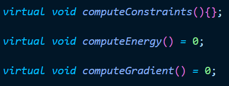
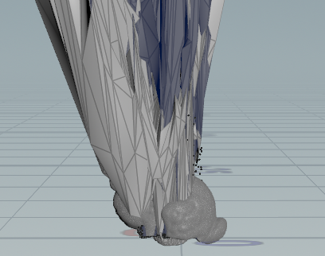
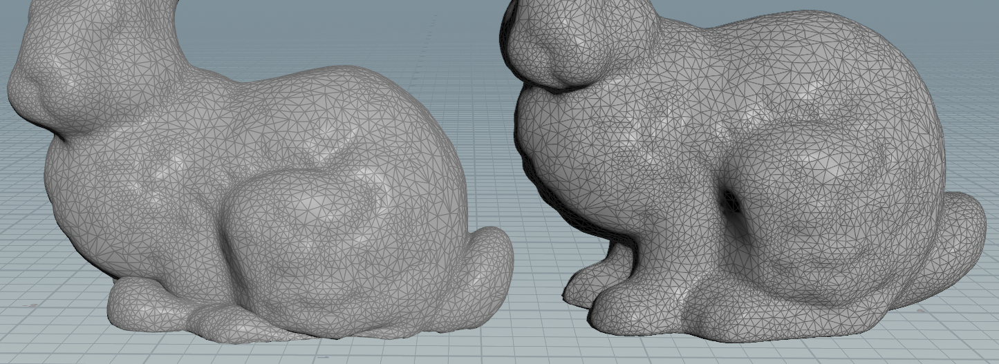

## c++虚函数

查了下c++的虚函数的用法，原来之前虚函数用不起来是因为基类是否需要实现傻傻分不清，普通的虚函数的基类必须有实现。

如果你的基类不想实现，可以使用下面的方式，直接放个空的实现上去。

## ipc复现

没加line search会变成这样，使用简单的模型：单个四面体后，发现四面体无法稳定停在地面，但是讲道理四面体不需要line search就应该可以稳定停在地面上。

将四面体的弹性力去掉，看它能不能稳得住，稳不住！
找到错误了，有一个地方的指针调用错了，鬼屎，取名字取太像了。

四面体会在地面滑行，不过这个无关紧要，因为没写摩擦力。

如果只用一次牛顿法则会出现下图的情况，这是因为碰撞能量会增加非线性，一次牛顿法无法使非线性方程组收敛，需要多牛几次才可以使得压缩量很大的四面体恢复正常
