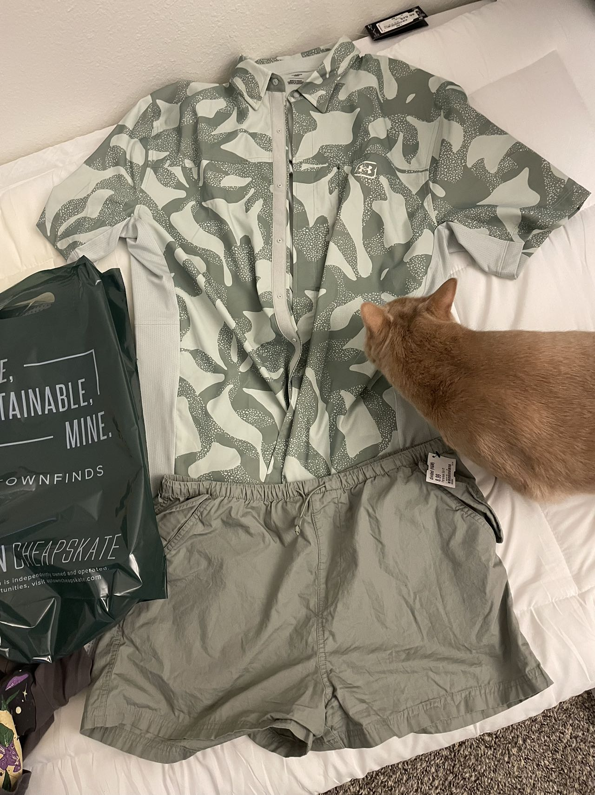
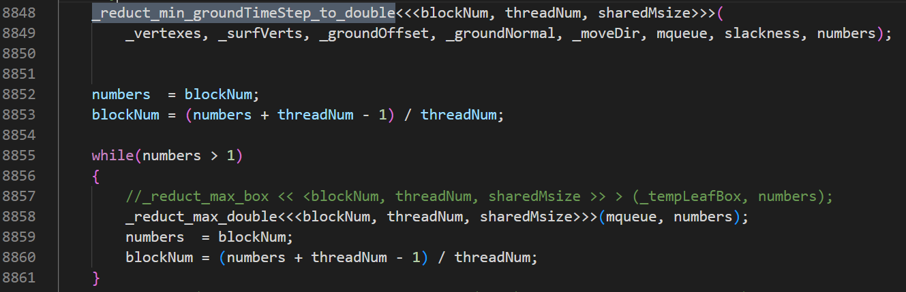

# 耕

## 旨

璇宝今天买的衣服，非常经典的衬衫，但是为什么是暗绿色，哈哈，独特的品味。


这几天玩守望感觉璇宝说话越来越大胆了，这是不是说明她更加相信我了，good good。
## ipc复现

gipc的实现中，在计算线搜索的初始值alpha的时候，用这么多核函数来写reduct_min操作，是不是可以合进一个核函数里面？


搞了个没有脑子的bug出来de了半天
这个函数在调用的时候，b我使用的1.0f，并没有给b一个地址，所以用不了引用

```c++
__global__ void Kernel_z_x_plus_by(vec3f* z,const vec3f* x,const vec3f* y,const float b,const int num);

__global__ void Kernel_z_x_plus_by(vec3f* z,const vec3f* x,const vec3f* y,const float& b,const int num);
```

总感觉这个里面的参数有非常玄妙的关系，会导致方程组解不解的出来，我现在的场景就有的解不出来，比较痛苦，我需要对特定场景进行分析。