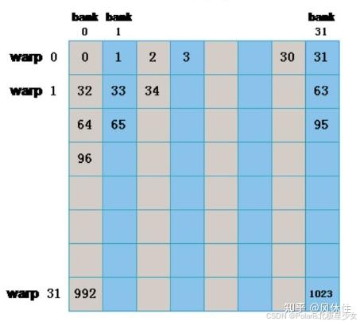
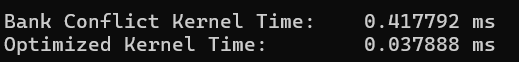

# Balance
## CUDA Challenge

第10和11讲 讲解的是shared memory和 sync threads的用法，这俩好像我之前早就用熟练了。

第12讲 讲的是bank conflict

声明共享内存 `__shared__ float sData[32][32]`，那么 `sData[0][0]`、`sData[1][0]`...`sData[31][0]` 位于 `Bank[0]`，`sData[31][0]`、`sData[31][1]`...`sData[31][31]` 位于 `Bank[31]`。

以下两种情况不会发生 Bank conflict：

- half-warp/warp 内所有线程访问不同 banks；
- half-warp/warp 内所有线程读取同一地址。 这个应该可以用shuffle同步，一个线程去拿就可以

可以用padding或者shuffle的操作来避免bank conflict

最后做实验下来确实慢了不少
