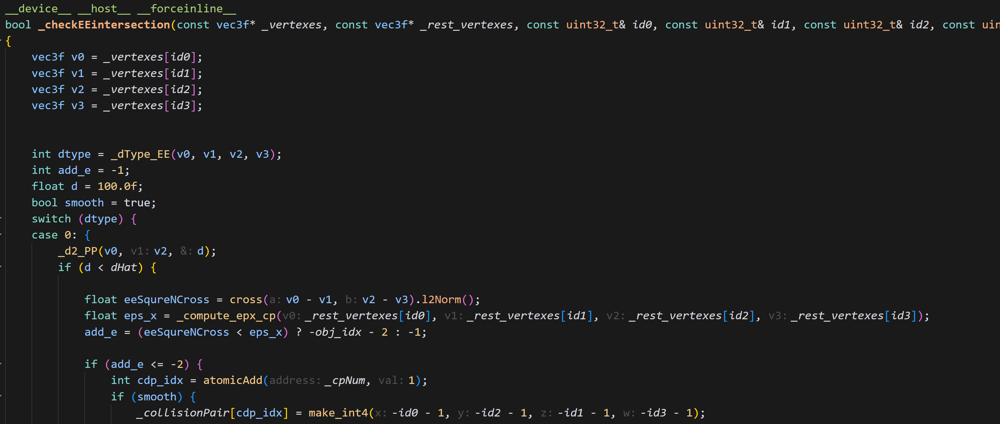
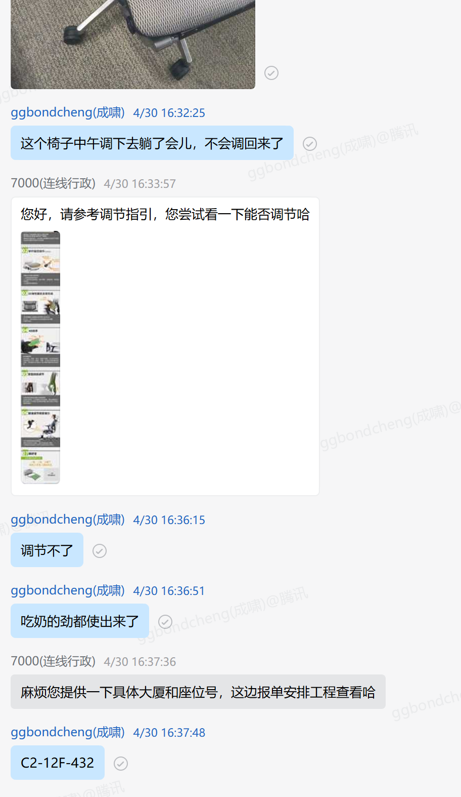

## ipc复现

1. 碰撞索引的MatIndex 是不是要加上偏移量？

答：不需要，碰撞的hessian矩阵会存在最前面，这种 行为感觉是不对的，碰撞矩阵动态变化，应该先把不变的矩阵放在前面，后面装动态的矩阵，这样每次修改的量最少。

2.下图检查ee碰撞对为啥要rest vertexs? 

## 椅子风波

原来只要向后靠一下就可以恢复了。

## UE编译

一开始报了一个chrono的bug，在头文件里面加入chrono.h的引用即可。

