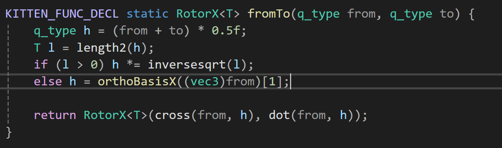

| 睡觉时间            | 13:00 |
| --------------- | ----- |
| 起床时间            | 8:20  |
| 健身              | ×     |
| cuda challenges | ×     |
今早起床全身和散架了一样，应该是之前撸铁的后遗症上来了。

## YarnBall

[Cosserat Rod 理论学习](https://zhuanlan.zhihu.com/p/515919508)

Cosserat Rod 模型的好处在于，它可以度量线型模型的**延展**（stretch）、**剪切**（shear）、**弯曲**（bend）和**扭转**（twist）四种应变，因此可以更加真实地模拟线型物体的物理运动[。

[四元数复习](https://krasjet.github.io/quaternion/quaternion.pdf)

这个四元数的原理讲的可以的昂，清晰易懂。

初始化，其实就是保存一些边的信息，我运行了Tree Generate 函数以后，生成了3326个边和3327个顶点，顶点确实应该比顶点多一个。

还存储了每个顶点的质量，每个边的质量，边的质量就是两个顶点质量的平均。边的原长，边从`(1,0,0)` 移动到边的朝向所需的四元数。

这个函数用的是下面这个公式，u是旋转轴。
$$ q = \left[ \sin\left( \frac{1}{2} \theta \right) \mathbf{u}, \cos\left( \frac{1}{2} \theta \right) \right] $$
还有两条边之间的夹角，只要用一个边的四元数的逆乘上另一个边的四元数就行。