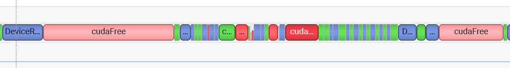
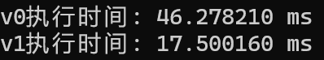
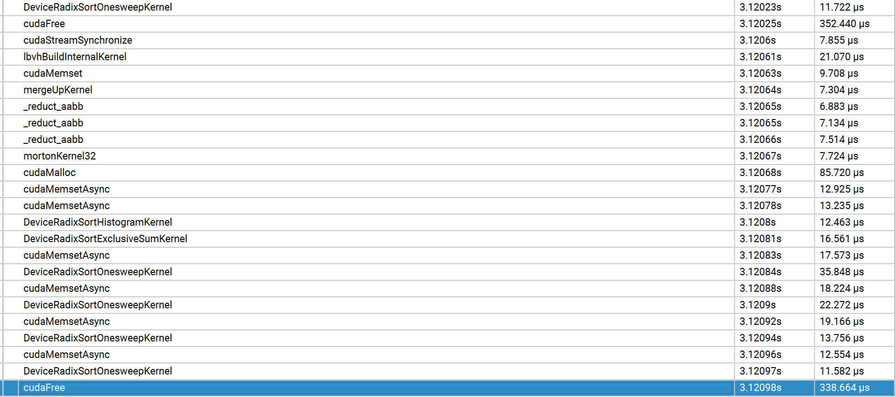

## GPU碰撞检测

对比了一下璇子的bvh构建和jerry的bvh构建。

jerry的构建数据在他的仓库页写了
但是我在3080上测下来建树需要800us，和3090差这么多吗。

用cuda system分析一看，在调用thrust reduce的时候涉及到gpu和cpu之间的数据传输，竟然还有cuda free，选择不用thrust，自己写reduce函数。

他是不是自己写了个不用thrust的reduce跑出的这个结果啊。thrust里的cudafree一个人就要跑230us了。

后面的实验跑在一个方布上，场景中有 79202x2 个面片，因为搞了两个布。
两个算法各跑50次，可以看到v0是vicky的算法，但是点进去看可以明显发现是cudaFree的时间占主要，还是去掉thrust以后再对比吧。

ok，写个了reduct aabb，速度提高了20%,继续看nsight system，可以发现

在调用 thrust::sort_by_key 的时候，会浪费很多时间在 cudamalloc 和 cudafree 上，搞定它！

首先先研究thrust有没有提供操作的接口，查了文档以后发现没有，这多捞啊，得自己写了。thrust是开源库，看一手thrust。

thrust 直接调的cub库，在cub库的dispatch_radix_sort.cuh里面有基排序的代码。

`num_items`  :排序元素个数
`RADIX_BITS = ONESWEEP_RADIX_BITS` : 一次基数排序的数位，通常设为 8 
`RADIX_DIGITS = 1 << RADIX_BITS ` : 256
`ONESWEEP_TILE_ITEMS = ONESWEEP_ITEMS_PER_THREAD * ONESWEEP_BLOCK_THREADS` 一个block处理的元素个数 = 线程数目 乘上 一个线程处理的元素个数

