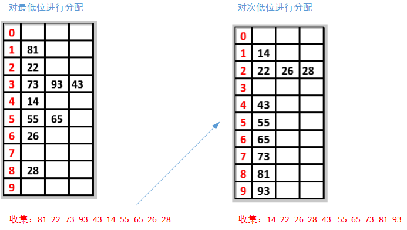
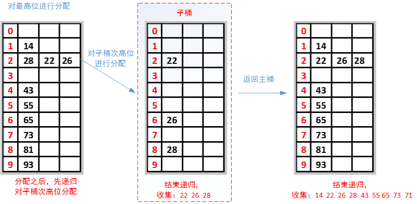

## Radix Sort

**LSD**（Least significant digital）：排序方式由数值的最右边（低位）开始

**MSD**（Most significant digital）：由数值的最左边（高位）开始。

**LSD**首先根据个位数的数值，在遍历数据时将它们各自分配到编号0至9的桶（个位数值与桶号一一对应）中。



MSD的方式由高位数为基底开始进行分配，但在分配之后并不马上合并回一个数组中，而是在每个“桶子”中建立“子桶”，将每个桶子中的数值按照下一数位的值分配到“子桶”中。在进行完最低位数的分配后再合并回单一的数组中。




[参考论文](https://arxiv.org/pdf/2206.01784)

论文导言
### **MSD基数排序的优点**

1. **高效利用内存层次结构**
    
    - 通过递归划分数据，子问题规模逐渐缩小，适合利用GPU等处理器的快速本地内存（如共享内存）。当子问题足够小时，可直接在高速内存中完成排序（"local-finishing"），减少全局内存访问开销。
        
2. **提前终止优化**
    
    - 如果高位数字已能唯一确定键的顺序，后续低位无需处理，减少不必要的操作（如短字符串排序中前缀差异大的情况）。
        
3. **性能优势（特定场景）**
    
    - 对于数据集分布不均匀或键值差异集中在高位时，MSD可能更快（如[9,18]提到的全局内存排序场景）。
        

---

### **MSD基数排序的缺点**

1. **复杂度与开销高**
    
    - 需递归管理多个子问题的分箱（binning），簿记开销大（如维护子问题栈、指针等）。
        
    - 递归调用可能导致函数调用开销或栈溢出风险。
        
2. **稳定性问题**
    
    - 默认实现不稳定（需额外操作保持稳定性），而稳定性是某些场景（如多键排序）的硬性要求。
        
3. **分布敏感性能**
    
    - 若键值分布集中（如高位数字相同），可能退化为大量小分箱，无法充分利用"local-finishing"优势。
        

---

### **LSD基数排序的优点**

1. **简单性与低开销**
    
    - 每轮处理一个数字位，只需全局遍历数据一次，无需递归或子问题管理，实现更简单。
        
2. **稳定排序**
    
    - 天然保持稳定性，适合需要保留原始相对顺序的场景（如按多字段排序）。
        
3. **性能一致性**
    
    - 性能与键值分布无关，每轮处理所有数据，适合均匀或不可预测分布的数据。
        

---

### **LSD基数排序的缺点**

1. **无法局部优化**
    
    - 每轮需处理全部数据，即使部分键已有序，仍需处理所有低位，无法利用高速内存加速。
        
2. **内存访问效率低**
    
    - 频繁全局内存操作（尤其是GPU场景），可能成为瓶颈。
        
3. **固定迭代次数**
    
    - 必须处理所有数字位，即使高位已可确定顺序。


### `__ballot_sync`

`_ballot_sync` 是 CUDA 中的一种 **Warp 级原语（Warp-Level Primitive）**，用于在 GPU 的线程束（Warp，通常包含 32 个线程）内进行高效的 **集体位掩码投票（Collective Bitmask Voting）**。它的主要作用是根据线程的 **条件判断**，生成一个 **32 位的掩码（mask）**，其中每一位代表对应线程的条件是否为真（1=真，0=假）

```cpp
__global__ void ballot_example(int *data, int *output) {
    int tid = threadIdx.x;
    int value = data[tid];
    
    // 生成掩码：标记所有 value > 0 的线程
    unsigned int mask = __ballot_sync(0xFFFFFFFF, value > 0);
    
    if (tid == 0) {
        *output = mask; // 存储掩码（例如 0b1011...）
    }
}
```
**输出**：如果 `data = {1, -2, 3, 0}`，则 `mask` 可能是 `0b0101`（线程 0 和 2 满足条件）。

### ``__popc``

`__popc` 是 CUDA 中的一个 **内置函数（Intrinsic Function）**，用于计算一个 32 位或 64 位整数中 **置位（1）的位数**（Population Count，即 **"popcount"**）。它的作用是高效统计二进制数中 `1` 的个数.

```cpp
__global__ void count_ones(int *input, int *output) {
    int value = input[threadIdx.x];
    int ones = __popc(value); // 统计 value 中 1 的个数
    output[threadIdx.x] = ones;
}

int main() {
    int input[] = {0xFF, 0xA, 0x1}; // 二进制: 11111111, 1010, 0001
    int output[3];
    
    // 调用 GPU 内核
    count_ones<<<1, 3>>>(input, output);
    cudaDeviceSynchronize();

    // output = {8, 2, 1}
}
```
