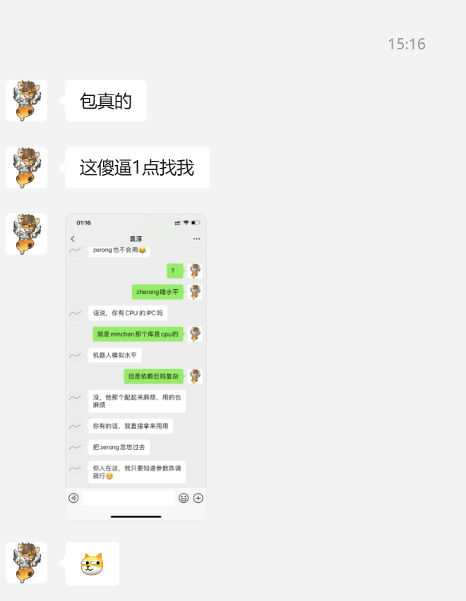
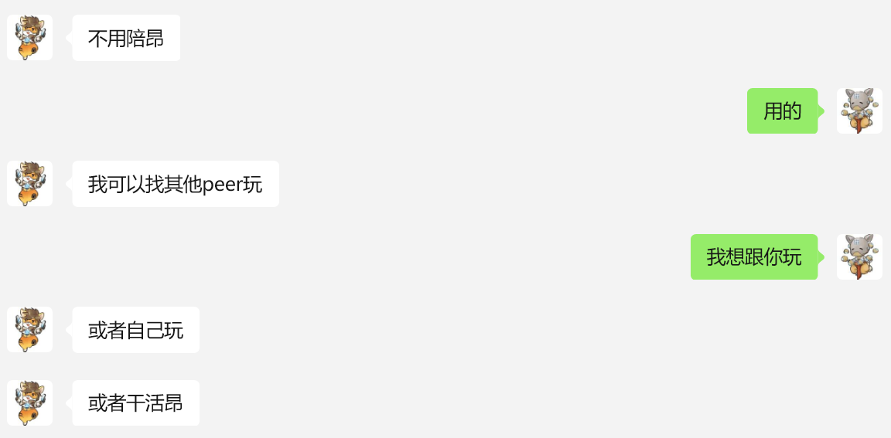

# 论emo的消除方法

不知不觉已经10天没写笔记了，今天正好是5月31日，给这个月结个尾吧。

写了点东西给子璇，本来想通过微信发给她，但是这件事情挺值得记录的，就写在日记上吧。

昨天子璇和我说她emo了，但是她不知道自己为什么emo。但是作为世界级的男朋友，即使是未知的原因，也要为子璇排忧解难。

从字面意思上分析有两种可能，一种可能是她真的不知道为啥emo，一种是她是因为我最近的某些差劲表现而emo，但是因为她不想让我难受所以假装说自己不知道为啥emo。

分析两种情况的可能性：需要引入辅助信息。如果没有辅助信息我无法做出进一步判断。

## 信息处理

信息来源：1. 和她打游戏时她的表现  2. 和她聊天时她说的话  3. 国际形势

### 游戏表现

首先来分析她的游戏表现，在我今天刚上号的时候，璇璇一直没有开麦，并且说是袁淳找她，发来一张截图如下。

分析该图中聊天内容可知，聊天内容非常简短，完全不至于不能说话，所以此处定然是不想和我说话。其次，在游戏过程中与我互动极少，与往日截然不同，单挑都站着不动。

通过上面信息可以推导出她emo的原因可能是我。

### 聊天

ok，接下来是聊天内容，主要截取重点分析

尽管有点断章取义的嫌疑，但是总感觉这两句话读起来怪怪的，总感觉她不是个随便说随便的人，这个随便可不能真的随便了。

上图甚至用上了排比句，让我感觉心惊肉跳，胆颤心惊，魂飞魄散，感觉以前从来没被这么说过。

后面她讨论起了抛弃这个话题，我能想到的唯一的原因就是我的某种行为让她产生了一种我可能抛弃她的危机感，所以她跑来询问我关于这个问题的看法。

聊天内容也指向了她emo的原因是我导致的。

### 国际形势

今天晚上吃晚饭的时候刷手机，发现特朗普在吊销中国留学生的签证，这个原因也可能导致璇子emo。感谢特朗普，给我搬回一局，maybe璇子是因为这件事情emo。

通过上述三个信息的分析，可以得出结论，璇璇大概率是因为我的某个行为而emo了。接下来分析如何消除她的emo。
## 论emo的消除

### 原因在我

假设我是emo的源头，那也不能把我解决了，应该想办法自我改变，反思可能导致她emo的原因:

1. 双休日和同学去车展鬼混，耽误了为数不多的和她打游戏的机会
2. 日记连续10天没写
3. 答应她的stackless query没写好
4. 聊天的时候不用心，有的时候一边敲代码一边和她聊，导致

首先我想排除2和3两点，因为这两件事情我之前都干过，但是璇璇从来没有因为这俩原因怪过我。

对于第一点，想想我之前基本每周都和她玩游戏，但是上周和这周我连续两次都因为朋友的事情而无法和她一起玩，确实有点粗心了，不能把和她一起的时间挤掉。

对于第4点，下次和她聊天的时候尽可能的不要看代码，尽量挑起话题，不过有一说一我现在越来越不擅长干这事儿了，昨天去和俩同学吃饭我也是跟着他们的话题走。

### 原因在特朗普

那是特朗普的问题，跟我没啥关系，我后面继续和璇子唧唧歪歪就行。特朗普能不能发点力给璇子送回来啊，我现在远程聊天能做的实在有限昂，很烦。

## 总结

其实璇璇问我关于蓝磊为什么不被他老婆抛弃的问题，她可能不太清楚人和人之间的关系是怎么维系的，或者爱人之间的关系是怎么维系的。我来讲一点自己的理解吧。

首先，关系的维系在社会上大概率是靠利益，两个人互相有利用价值，那么他们可以在一起走一段路，直到一方对另一方没有利用价值了，那么两人自然就会分开。我觉得靠利益维系的关系，不是很长久，但是也无可厚非。

其次，靠情义。但是情义很抽象呀，情义要怎么具象化呢？我觉得就看你和那个人一起走过的路，在路上的互相搀扶和帮助，会催生情义。就拿我俩举例吧，你总说你不知道自己哪里细节，问了我，我也不说，这次我就来说一说吧。

首先你每周基本都和我在一起玩游戏，只有我鸽你，没有你鸽我。其次你会调整自己的作息时间来陪我，但是我觉得这个很难啊，毕竟谁不想在床上多睡会儿呢。而且你还关心我的博士录取信息，签证信息，鬼屎，反正就是感觉你很关心我，比我自己都关心我自己，我天天都过的很快乐。最近这几天我的生活状态越来越好了，干活的效率和积极性大大提高，我觉得这都是你带给我的，因为你给我投入了很多，我不想让你的付出白费。

因为你对我的付出，导致我对你产生了深厚的感情。但是感情这个东西很飘渺呀，我今天对你有感情，可能明天对你就没感情了。感情它不是一个实物，比如你有一两黄金你就真的有一两黄金，但是你有我的感情我随时都可以收回，只要我无情。

ok，所以我接下来要引入一个新的名词，叫作惯性。惯性是啥呢，惯性就是爱一个人的持久性，举个例子，A爱着B，B反过来伤害了A，但是因为爱，A仍然爱着B，因为A已经习惯了爱B这件事情，已经根植在了A的脑子里面，即使被B伤害，他也能继续爱着。这件事情是不是有点反直觉，在外人看来A就是傻子，如果他精明一点就应该直接跑掉，因为已经获得不了利益了。

那么接下来就是要证明我有惯性了，我自认为是有惯性的昂。首先，我比较看轻金钱，不上进，但是这恰恰可以反推出我看重情义，我不喜欢靠利益维系的关系。其次，我从小有个姑姑给我做榜样，她教我爱一个人的正确方式。最后，我看上去就不聪明是不是，不聪明的人脑子转的慢，转不过弯来，所以可以推测出我有惯性对不对？

回到经典论题，假设一个比你更优秀更适合我的姑娘出现，我会跟着那个姑娘跑掉吗，我们两之间的羁绊已经如此的深厚，我不会忍心看我爱的姑娘难受的。说实话，有的时候我觉得你就是天使投资人，嗷嗷给我资源，博士老师也是你帮忙找的，有这些事情我就很难把你抛弃啊，更何况我脑子还转不过弯来经常宕机。

怎么说呢，感觉你有点像我生命里的一份子了，但是你好像还在担心些什么。确实在让人安心这件事情上我没你做的到位，我会加油的昂。

给你推个歌，别emo啦。

<iframe src="https://player.bilibili.com/player.html?isOutside=true&aid=113356719524592&bvid=BV1xYyfYhEXu&cid=26428834034&p=1&autoplay=false" scrolling="no" border="0" frameborder="no" framespacing="0" allowfullscreen="true" ></iframe>
