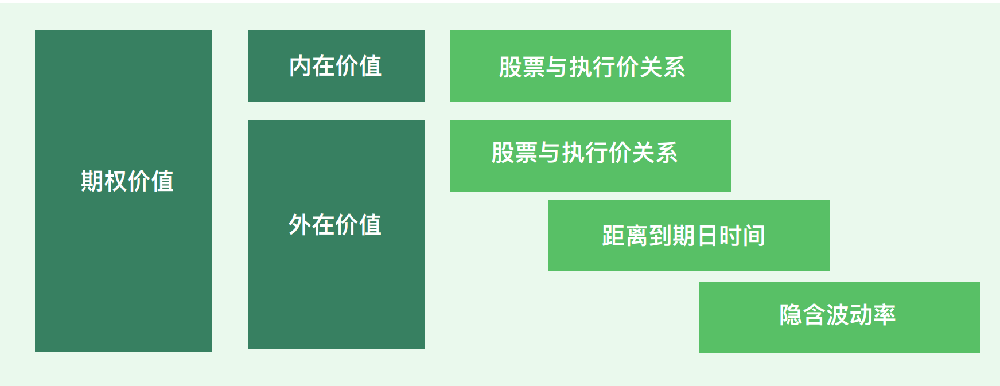
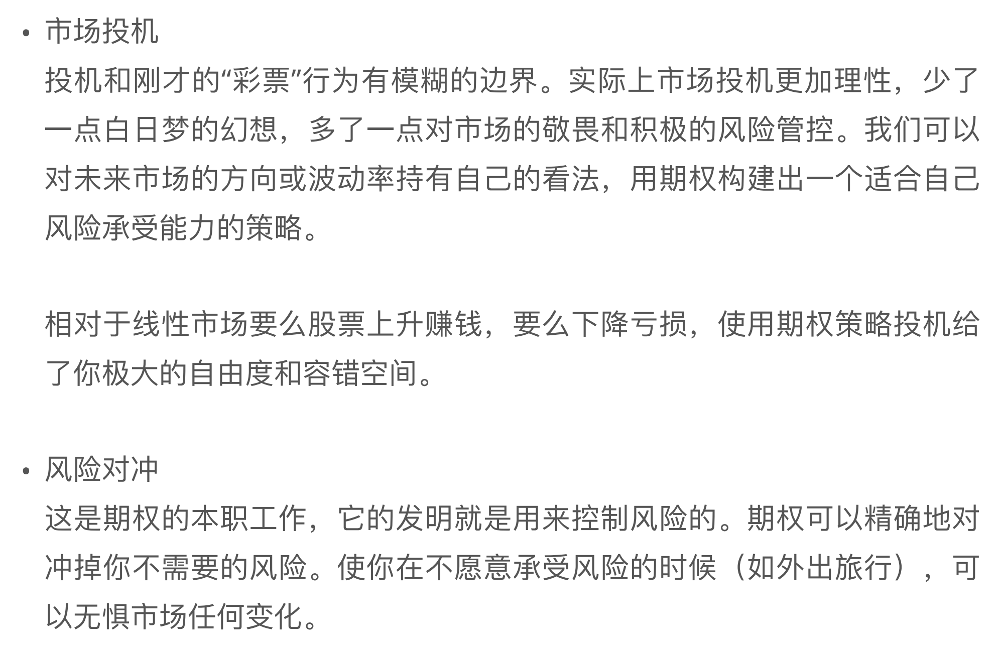
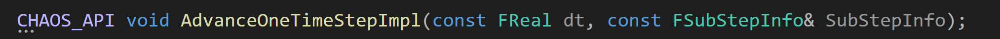
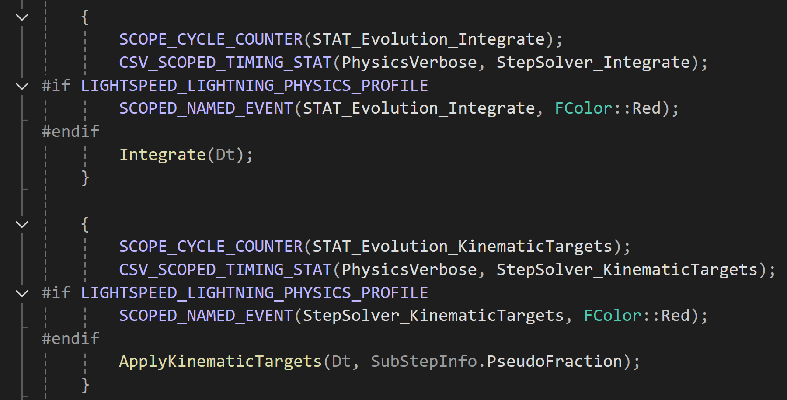
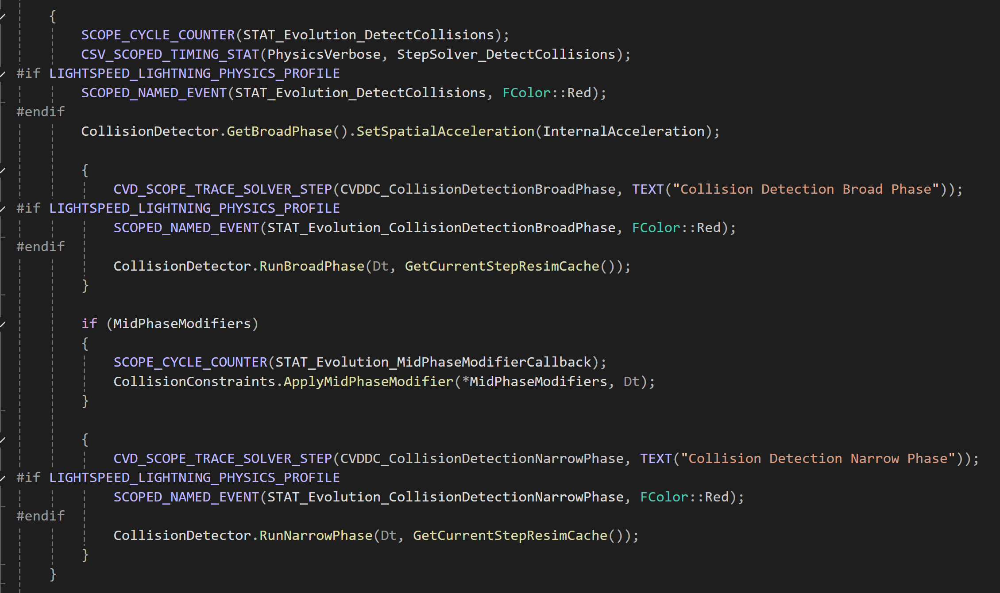
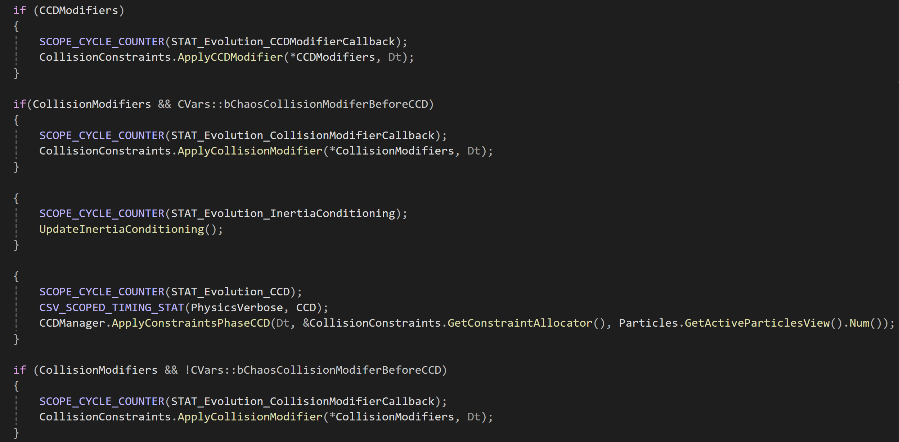
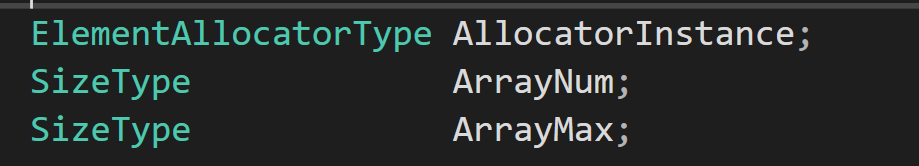
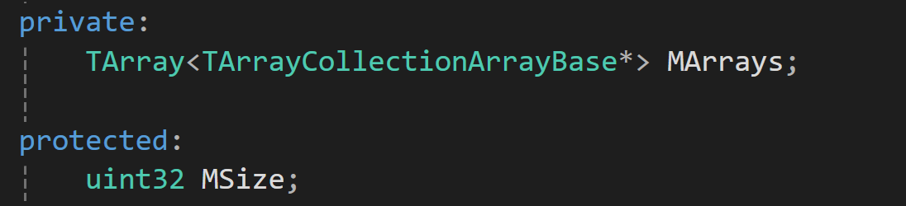

| 睡觉时间 | 12:30 |
| ---- | ----- |
| 起床时间 | 7:45  |
|      |       |
## 期权入门



这个巴特菲是谁？
## 开工
参考[知乎链接](https://zhuanlan.zhihu.com/c_1406626318495117312)

在Source/Runtime/Experimental/Chaos 文件夹下面的PBDRigidsEvolutionGBF文件里面，有一个

函数，这个函数里面包含了仿真一帧的过程。

时间积分Integrate过程，这个ApplyKinematicTargets是固定点约束之类的东西吗？我看下来他把某些位置reset到0了。

上面这部分代码应该是我的主要研究对象，中间有broad phase和narrow phase，用于碰撞检测，待会儿点进去看看。

下面的这段代码是ccd过程。ApplyConstraints应该是拿检测到的碰撞约束去做碰撞响应。


论文待读[Nonconvex Rigid Bodies with Stacking](https://graphics.stanford.edu/papers/rigid_bodies-sig03/)  ,讲mesh碰撞仿真流程的，GBF是这篇论文三个作者名字的缩写。


### 数据结构

TArray应该是手写了一个类似vector的数组

TArrayCollection 是数组的数组，这个的功能应该是把刚体的多个属性放到一个数组里面。


刚体的几何数据存在下面这个文件里面，可以看到MR就是这堆刚体的朝向数组，MGeometry就是几何形状数组。Chaos的几何形状基类型是FImplicitObject，其派生出了很多种形状，比如TSphere，TBox，TPlane，TConvex等等，里面有对应的几何数据以及相交检测算法。
```cpp
CHAOS_API TGeometryParticlesImp() : TParticles<T, d>()
{
	MParticleType = EParticleType::Static;
	TArrayCollection::AddArray(&MUniqueIdx);
	TArrayCollection::AddArray(&MR);
	TArrayCollection::AddArray(&MGeometry);
	TArrayCollection::AddArray(&MSharedGeometry);
	TArrayCollection::AddArray(&MDynamicGeometry);
	TArrayCollection::AddArray(&MParticleIDs);
	TArrayCollection::AddArray(&MShapesArray);
	TArrayCollection::AddArray(&ImplicitShapeMap);
	TArrayCollection::AddArray(&MLocalBounds);
}
```

有了形状之后，要想让刚体动起来还需要一些运动属性，比如速度，角速度等，于是从**TGeometryParticlesImp**派生出了**TKinematicGeometryParticlesImp**类型，用来表示运动(Kinematic)的物体。当然，一个真实物理刚体还需要力、力矩、质量、冲量等等这些物理属性，**TKinematicGeometryParticlesImp**又派生出了**TRigidParticles**用来表示动力学(Dynamic)刚体。最后，chaos从TRigidParticles派生出了**TPBDRigidParticles**，加入了一些用来方便实现PBD方法的变量，至此，一个完备的刚体类型才算成型了。派生关系如下：

1. **TParticles**
2. **TGeometryParticlesImp**
3. **TKinematicGeometryParticlesImp**
4. **TRigidParticles**
5. **TPBDRigidParticles**

### 碰撞检测初探

在chaos中， 比较关键的几种体类型是：

球体Sphere、方盒Box、平面Plane、胶囊体Capsule、凸包Convex、三角网格TriangleMesh、高度场HeightField。这些类型基本可以囊括游戏中需要的各种形体。

针对这些形体之间配对组合，计算碰撞的算法也不尽相同。通过排列组合，我们可以知道需要21种算法。（7x6/2）

先来看看broad phase，围绕树的建立和遍历分析代码。

在介绍空间算法之前，我们需要了解包围体的概念，因为无论何种空间算法，其管理的都不是原本的形状，而是形状的简化——包围体。包围体有很多种，引擎中最常使用的是轴对齐包围盒（AABB），简单来说就是一个跟坐标轴对齐的且大小正好可以包裹住模型的盒子。下图可以直观的看到这种盒子的样子


虽然用这种盒子来进行碰撞检测的结果会很不精确，但好在算法复杂度很低，易懂易实现，无论是拿来做碰撞检测还是构造空间树形结构都能极大的提高效率。在粗略碰撞检测阶段，AABB盒子就已经足够胜任了。

用盒子做碰撞检测的算法如下：

```text
for (int32 i = 0; i < d; ++i)
{
	if (Other.MMax[i] < MMin[i] || Other.MMin[i] > MMax[i])
		return false;
}
```

生成AABB盒子的算法也比较简单，针对每一种形状的生成算法都不同，这些形状包括 FKSphereElem（球体）、FKBoxElem（盒子）、FKSphylElem（胶囊体）、FKConvexElem（凸包）、FKTaperedCapsuleElem（两头不一样大的胶囊体）以及FKAggregateGeom（组合体），对应的生成函数是

```text
FBox CalcAABB(const FTransform& Transform) const;
```

函数实现都比较简单，这里只介绍生成凸包的AABB的方法：

简单来说就是一句话，遍历所有顶点，然后在每个轴向上分别找出最大最小值来构成AABB盒子的最大最小顶点

截取部分UE的代码实现：

```text
void FKConvexElem::UpdateElemBox()
{
	for(int32 j=0; j<VertexData.Num(); j++)
	{
		ElemBox += VertexData[j];
	}
}
FORCEINLINE FBox& FBox::operator+=( const FVector &Other )
{
	if (IsValid)
	{
		Min.X = FMath::Min(Min.X, Other.X);
		Min.Y = FMath::Min(Min.Y, Other.Y);
		Min.Z = FMath::Min(Min.Z, Other.Z);

		Max.X = FMath::Max(Max.X, Other.X);
		Max.Y = FMath::Max(Max.Y, Other.Y);
		Max.Z = FMath::Max(Max.Z, Other.Z);
	}
}
```

因为我们假设物体的形状在游戏中不变，所以AABB盒子可以在游戏一开始提前算好，但我们还忽略了一个的问题，因为刚体是可以旋转的，只要朝向一变，在世界空间中的AABB盒子就会发生变化，提前计算的AABB就失效了，解决方法很简单，我们只需要在运行过程中变换提前生成的AABB盒子到世界空间中，再对其生成一遍AABB盒子就可以了，这样无论多复杂的凸包都只需要遍历8次（也就是盒子的8个顶点），比遍历凸包所有顶点效率高得多。UE重新生成世界空间AABB盒子的代码在这里：

```text
inline TAABB<T, d> TransformedAABBHelper(const TAABB<T, d>& AABB, const TTRANSFORM& SpaceTransform){
// Full and empty bounds do not transform
if (AABB.IsFull() || AABB.IsEmpty())
{
	return AABB;
}

// Initialize to center
FVec3 Translation(SpaceTransform.M[3][0], SpaceTransform.M[3][1], SpaceTransform.M[3][2]);
FVec3 Min = Translation;
FVec3 Max = Translation;

// Compute extents per axis
for (int32 i = 0; i < 3; ++i)
{
	for (int32 j = 0; j < 3; ++j)	
	{
		FReal A = SpaceTransform.M[j][i] * AABB.Min()[j];
		FReal B = SpaceTransform.M[j][i] * AABB.Max()[j];
		if (A < B)
		{
			Min[i] += A;
			Max[i] += B;
		}
		else 
		{
			Min[i] += B;
			Max[i] += A;
		}
	}
}

return TAABB<T, 3>(Min, Max);

}
```

chaos目前使用了四种空间加速结构，分别是**TAABBTree**、**TBoundingVolume**、**TAABBTree**和**TBoundingVolume**的组合，以及**TBoundingVolumeHierarchy**。

下面将依次介绍这些树形结构


### TAABBTree

构造树的过程如下，假设场景中有一堆刚体

1. 分别为这些刚体生成世界空间AABB盒，创建包含所有刚体的根节点
2. 生成可以包围节点内所有刚体AABB盒的节点AABB盒
3. 找到节点包围盒在哪个轴向上长度最长，以该轴方向为基准将节点包围盒平均分成两个子AABB盒，作为两个子节点的包围盒
4. 依次遍历节点中的所有刚体AABB，判断其属于哪个子节点，如果刚体AABB正好在交界处，则根据跟哪个子节点重叠的体积大来决定。
5. 如果两个子节点都有所属刚体，则分别把两个子节点作为父节点从第2部开始下一次循环，如果有一个子节点没有刚体，则创建叶子节点，并跳出循环。

**Chaos中的一些实现技巧：**

1. 判断刚体跟哪个子节点AABB重叠的体积大，可以通过判断刚体AABB跟哪个子节点的交集体积小来决定。可以看下图
2. 因为世界中的刚体非常多，构造树的过程会花费很多时间，而且因为经常会发生刚体的增添删除等操作，树结构也会发生大幅度变化，更新树结构还不如重新构造来的方便，chaos采用的方法是不断的构造该树形结构，但如果在主线程每帧都执行构造树的方法，游戏帧率势必会大幅度降低。Chaos又将该构造过程放在了另一个线程，而且构造过程是分时间片的，每帧可以划分的刚体数量有上限，大约有2000个，如果超了就只能下一帧再继续了。该方法还有一点需要特别注意，另一个线程在构造树的过程中，如果世界中的刚体发生了变化，需要更新树结构，那该怎么办？chaos使用的方法是类似双缓冲的方法，主线程和构造线程都有树形结构，在构造线程构造过程中，可以先更新主线程的树形结构（注意这里并不是真的更新，而是将这些刚体缓存下来，作为独立于树的个体DirtyElements，这也意味着每次碰撞检测都要考虑这些额外的刚体，当额外刚体数量过多时，需要考虑重新构造树形结构），等另一个线程构造完了，再一股脑把这些缓存的更新用在新树上，最后将新树copy到主线程。

### TBoundingVolume

这不是树形结构，而是网格体。它将空间划分成均匀的立方体单元格，刚体AABB跟哪些单元重叠，就加入这些单元的数组中。

构造过程如下：

1. 遍历所有的刚体，计算所有刚体的包围盒以及立方单元格的长度，计算长度的算法既需要考虑所有刚体AABB的大小，还需要考虑这些刚体AABB的长宽高。所以，chaos采用的算法是

```text
for 所有刚体
{
	Dx += DotProduct(Vector(刚体包围盒长宽高), Vector(1,1,1)) / 3;
}
Dx = Dx / 刚体数量;
```

2. 将包围盒按照计算出的长度划分成均匀的立方格，相当于引入了新的坐标系统，坐标的粒度就是单元格长度，遍历所有刚体AABB，计算这个AABB覆盖了哪些单元格，遍历这些单元格，将刚体的索引加入单元格的数组中，完成刚体的空间划分。

鉴于该结构比较容易理解，Chaos的实现比较简单，没有多线程时间片构造，这里就不再展开实现细节。

## TAABBTree和TBoundingVolume的组合

TAABBTree作为主要数据结构，TBoundingVolume作为叶子节点。该复合结构集成了两种结构的优点。

TAABBTree在处理相隔比较远的刚体簇的时候比较有优势，但在处理一些均匀分布的情况下明显不如TBoundingVolume。TAABBTree要尽量控制层级不要过多，否则会增加递归调用次数，降低查询效率。TBoundingVolume也要保证划分粒度不能太大，所以，TAABBTree用来处理大场景，TBoundingVolume用来处理小场景，两者结合会非常有效