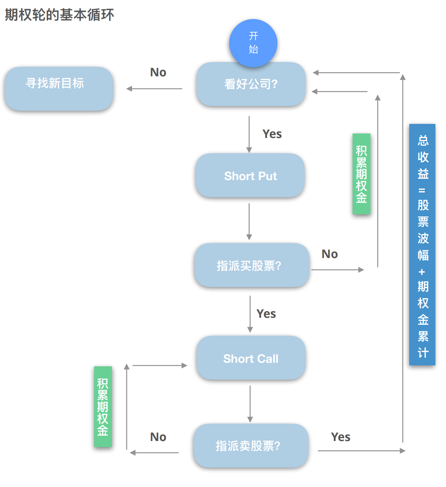
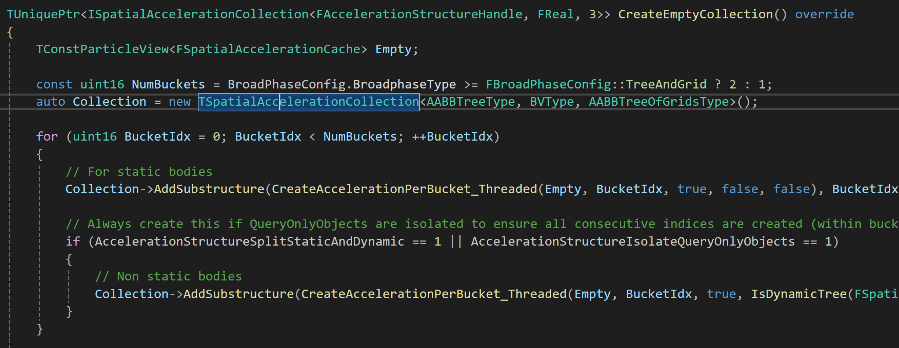
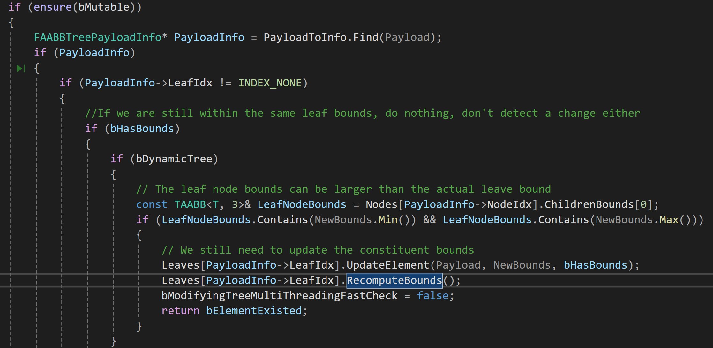
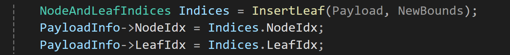

| 睡觉时间 | 12:25 |
| ---- | ----- |
| 起床时间 | 7:49  |
| 健身   | √     |

## 记录

这种不带大脑的聊天真的好舒服呀，有点看短剧的感觉了。

被璇宝小小地嘲讽了一下，可爱捏，以后中午直接麻辣烫，节约经济。


## 期权

早上看到OTM的时候突然忘了这三个字组在一起啥意思了，下图解释了

手上没有股票的时候，可以不用直接买股票，而是卖给别人看跌合约，期权金为2元。假设股票没有跌破执行价100元，那么这个期权金就是白赚的。假设跌破了执行价，比如跌到98元，那么你就需要花100元执行价去买98元的股票，但是期权金赚了2块，所以相当于不赚不亏，期权金可以帮你缓冲，可以的昂，怎么感觉这么搞很赚呢。

假设刚才股票跌破了执行价，你买了100股刚刚大跌的股票，那么你可以

假设你发现这个股票后面没有跌的很厉害，那么可以再操作一次，卖出看涨期权来赚取期权金。


## UE broad phase
```cpp
/** Used for updating intermediate spatial structures when they are finished */
struct FPendingSpatialData
{
	FAccelerationStructureHandle AccelerationHandle;
	FSpatialAccelerationIdx SpatialIdx;
	int32 SyncTimestamp;	//indicates the inputs timestamp associated with latest change. Only relevant for external queue
	EPendingSpatialDataOperation Operation;
}

struct FPendingSpatialDataQueue
{
	TArray<FPendingSpatialData> PendingData;
	TArrayAsMap<FUniqueIdx,int32> ParticleToPendingData;
}

/** Pending operations for the internal acceleration structure */
FPendingSpatialDataQueue InternalAccelerationQueue;

/** Pending operations for the acceleration structures being rebuilt asynchronously */
FPendingSpatialDataQueue AsyncAccelerationQueue;

/*在函数FlushAsyncAccelerationQueue()中，有下面的函数，它会将每个刚体的包围盒构建一个场景的bvh */
const bool bExisted = AccelerationStructure.UpdateElementIn(UpdateParticle, UpdateParticle->WorldSpaceInflatedBounds(), UpdateParticle->HasBounds(), SpatialData.SpatialIdx);
```

从下面的叶子节点代码可以看出这是个二叉树
```cpp
struct TAABBTreeNode
{
    TAABB<T, 3> ChildrenBounds[2];
    int32 ChildrenNodes[2];
    int32 ParentNode;
    bool bLeaf : 1;  //定义该节点是不是叶子节点
    bool bDirtyNode : 1;
}
```

AABBTree.cpp中
```cpp
//设置叶子节点中最大的刚体数量
int32 FAABBTreeCVars::DynamicTreeLeafCapacity = 8;
FAutoConsoleVariableRef FAABBTreeCVars::CVarDynamicTreeLeafCapacity(TEXT("p.aabbtree.DynamicTreeLeafCapacity"), FAABBTreeCVars::DynamicTreeLeafCapacity, TEXT("Dynamic Tree Leaf Capacity"));

//包围盒padding
float FAABBTreeCVars::DynamicTreeBoundingBoxPadding = 5.0f;
FAutoConsoleVariableRef FAABBTreeCVars::CVarDynamicTreeBoundingBoxPadding(TEXT("p.aabbtree.DynamicTreeBoundingBoxPadding"), FAABBTreeCVars::DynamicTreeBoundingBoxPadding, TEXT("Additional padding added to bounding boxes for dynamic AABB trees to amortize update cost"));

//这个是静态树的叶子节点的最大刚体数，只在初始化的generate tree 中用到
FAutoConsoleVariableRef CVarMaxChildrenInLeaf(TEXT("p.MaxChildrenInLeaf"), BroadPhaseConfig.MaxChildrenInLeaf, TEXT(""));
```


看了下给树插入新的节点的过程，但是我很好奇这么一个一个插入这对吗，难道不是应该一开始获取所有的aabb，然后根据最大的那个盒子分成两个小盒子，然后依次递归吗，为啥会有一个一个加入的过程。

CreateEmptyCollection()函数介绍了初始化树的过程，会初始化两个树，一个树是静态的，一个树是动态的，这里树还没有建立出来。


定位到更新树的过程：其实并不是重建，它是有rebuild的过程的，在UpdateElement函数中，对于每个刚体，先去表中查找它所在的叶子节点，一般一个叶子节点包含至多8个刚体，假设该刚体新的aabb被包含在了这个叶子节点原来的aabb里面，那么就没有必要去更新树，只需要更新叶子节点的aabb包围盒，因为它有可能缩小。当然，如果你想更新被这个叶子节点影响的祖宗节点也是可以的，但是没有必要。

如果这个刚体运动的很不合群，以至于它无法被原来的叶子节点囊括进来，甚至它可能运动的非常剧烈，把它放在原来的叶子节点里面会导致该叶子的aabb变的非常大，导致bvh遍历的效率大大降低。那么就要把这个刚体从树里面去除了，然后再把它当成一个新的刚体插入到树里面。


坏了，这个方法感觉非常的合理呀，是不是没我什么事情了。。。看看physX是怎么做的吧。