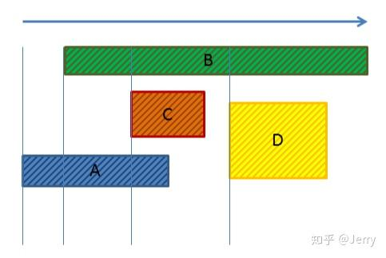

| 睡觉时间            | 13:10 |
| --------------- | ----- |
| 起床时间            | 8:40  |
| 健身              | √     |
| cuda challenges | √     |
| ipc             | 2h    |
昨天慢跑了三十分钟感觉要散架了。

## 期权

到期日的权衡，期权到期日越长，价格越高。

需要学习下几个希腊字母，不然看不懂后面的

## PhysX

### PhysX算法介绍

#### SAP算法

PhysX在Broad Phase中采用的是一种称之为Sweep And Prune（SAP）算法，它将所有物体AABB盒的Min点与Max点分别在XYZ轴上投影，如果在某一轴上不满足Max1 > Min2 && Max2 > Min1则不会发生碰撞。

具体见下图示（以在横轴X方向上的投影为例）：

第一步：排序

对ABCD四个图形按最小点排序，由小到大（由左及右）的顺序分别是A,B,C,D

第二步：建立碰撞可能性列表List\_X

对每个对象进行遍历，先是A，按之前排序的顺序往下检测：

检测B，发现AB满足最大点大于最小点的充要条件，则将{A,B}加入List\_X中

检测C，发现AC也满足最大点大于最小点，则将{A,C}加入List\_X中

检测D，发现A的最大点小于了D的最小点，不加入List中，因为是事先排过序的，所以D之后的物体不再检测

然后回到外层循环，同理对B,C,D分别处理

得到可能性列表List\_X={A,B}, {A,C}, {B,C}, {B,D}。

第三步：对其他轴向进行检测，得到List\_Y, List\_Z，只有同时位于三个列表中的pair才是可能的碰撞对。

但第三步这里对空间存储的要求比较大，需要存储三个列表，每个列表中也会包含大量元素pair，所以另一种可取的方案，是在List\_X的基础上进行Y和Z轴的校验，不通过就直接从List\_X中排除，这样只用一个列表的空间就能搞定。

有些同学可能会对第二步质疑，内外两循环看上去仍是O(N^2)的复杂度，但因为有了第一步排序，可以快速排掉不满足条件的后面所有碰撞体，所以平均复杂度是降低了，加上排序的平均时间复杂度，SAP算法的平均复杂度是O(nlogn)。

#### MBP算法

SAP对于大量静态物体的场景效果很好，但对于运动的对象，需要进行增量更新，如下图：

红色运动物体在Y轴方向运动，尽管它们在X轴上相差很远，但传统SAP还是不得不更新它在Y轴上的信息。为了进一步利用空间相关性解决上述问题，不少SAP的改进算法，如Multi-SAP，Multi Box Pruning（简称MBP）等将世界划分成网格，如下：

  

在每一个网格中进行局部的SAP，辅以并行计算的技术，要比SAP更快，代码可以参见：
[www.codercorner.com/BoxPruning.zip](http://www.codercorner.com/BoxPruning.zip)

在PhysX 3.3版时，引入MBP算法如下：  

第一步：计算所有对象的整体包围盒，下图圆圈表示物体，外层黑框是它的整体大包围盒。

第二步：切分这个包围盒，划规成四个子计算区间。

第三步：按各自区域进行分类，如下：

每个颜色表示各自的归属。

第四步：考虑轴线上的物体的归属，因落入了两个或两个以上的区域，所以这些区域内都需要添加。在实际计算过程中，轴线左侧两个小红球，它们在绿色区域内会检测到碰撞，同时在蓝色区域内也会检测到碰撞，但如果碰撞列表用hashmap来做，就不用担心重复性。

第五步：对每一个区域递归地进行划分，比如左上绿色区域再划成四块，直到区域足够小为止。

之后在每个小区域内进行经典SAP的计算，就可以了。

对比下经典SAP与MBP算法，可以看到MBP的优点在于计算更快，特别是大量动态对象的碰撞计算，缺点就是需要有“网格”的概念，即需要知道世界边界；SAP则不需要边界信息，对静态对象碰撞计算更友好。

### 代码阅读

去查了PhysX关于broad-phase的文档：

PhysX supports several broad-phase algorithms:

* *sweep-and-prune (SAP)*
* *multi box pruning (MBP)*

*PxBroadPhaseType::eSAP* was the default algorithm used until PhysX 3.2. It is a good generic choice with great performance when many objects are sleeping. Performance can degrade significantly though, when all objects are moving, or when large numbers of objects are added to or removed from the broad-phase. This algorithm does not need world bounds to be defined in order to work.

*PxBroadPhaseType::eMBP* is a new algorithm introduced in PhysX 3.3. It is an alternative broad-phase algorithm that does not suffer from the same performance issues as eSAP when all objects are moving or when inserting large numbers of objects. However its generic performance when many objects are sleeping might be inferior to eSAP, and it requires users to define world bounds in order to work.

The desired broad-phase algorithm is controlled by the *PxBroadPhaseType* enum, within the *PxSceneDesc* structure.

===================
Regions of Interest
===================

A region of interest is a world-space AABB around a volume of space controlled by the broad-phase. Objects contained inside those regions are properly handled by the broad-phase. Objects falling outside of those regions lose all collision detection. Ideally those regions should cover the whole game space, while limiting the amount of covered empty space.

Regions can overlap, although for maximum efficiency it is recommended to minimize the amount of overlap between regions as much as possible. Note that two regions whose AABBs just touch are not considered overlapping. For example the *PxBroadPhaseExt::createRegionsFromWorldBounds* helper function creates a number of non-overlapping region bounds by simply subdividing a given world AABB into a regular 2D grid.

Regions can be defined by the *PxBroadPhaseRegion* structure, along with a user-data assigned to them. They can be defined at scene creation time or at runtime using the *PxScene::addBroadPhaseRegion* function. The SDK returns handles assigned to the newly created regions, that can be used later to remove regions using the *PxScene::removeBroadPhaseRegion* function.

A newly added region may overlap already existing objects. The SDK can automatically add those objects to the new region, if the *populateRegion* parameter from the *PxScene::addBroadPhaseRegion* call is set. However this operation is not cheap and might have a high impact on performance, especially when several regions are added in the same frame. Thus, it is recommended to disable it whenever possible. The region would then be created empty, and it would only be populated either with objects added to the scene after the region has been created, or with previously existing objects when they are updated (i.e. when they move).

Note that only *PxBroadPhaseType::eMBP* requires regions to be defined. The *PxBroadPhaseType::eSAP* algorithm does not. This information is captured within the *PxBroadPhaseCaps* structure, which lists information and capabilities of each broad-phase algorithm. This structure can be retrieved by the *PxScene::getBroadPhaseCaps* function.

Runtime information about current regions can be retrieved using the *PxScene::getNbBroadPhaseRegions* and *PxScene::getBroadPhaseRegions* functions.

The maximum number of regions is currently limited to 256.

将一个aabb切成很多长条。

怎么感觉有点空间哈希的感觉，将空间划分成格子，然后把aabb存到格子里面，但是这里为什么建议是4x4的格子数，是不是有点少了？

PhysX的几何数据也是7种类型

对于单线程来说
FlushInternalAccelerationQueue 是计时核心

动态场景和静态场景对比

测试场景1：静态场景，在运动一段时间后该场景几乎没有刚体位移

测试场景2：动态场景，空中的立方体一直在运动

实验1：静态场景

p.aabbtree.DynamicTreeLeafCapacity = 1

实验2：动态场景

p.aabbtree.DynamicTreeLeafCapacity = 1

其中`InsertLeaf`函数就是将刚体当作一个新的刚体插入树的过程，其中`FindBestSibling`是查找新的刚体应该被放到哪个叶子节点，`UpdataAncestorBounds`是刚体被放入新的叶子节点后，该叶子的节点的所有祖宗节点都要更新。

实验3：动态场景

p.aabbtree.DynamicTreeLeafCapacity = 8

实验1可以看出静态场景几乎不更新树。

实验2对比实验3

可以看到p.aabbtree.DynamicTreeLeafCapacity = 8的树一次更新所需的时间相比于p.aabbtree.DynamicTreeLeafCapacity = 1的时候更快了。这是由于插入叶子节点操作变少导致的。

有些不需要更新aabb的刚体，他们的更新就几乎没有计算量。

`InternalAccelerationCacheOverlappingLeaves`对每一个叶子节点，查找和它重叠的其他叶子节点，用于后面的narrow phase。
## 论文阅读

[TEMPORAL COHERENCE IN BOUNDING VOLUME HIERARCHIES FOR COLLISION DETECTION](https://is-web.hevra.haifa.ac.il/staff/ishimshoni_files/TSTD_06.pdf)
Our basic premise is that in dynamic environments, objects comprising the scene do not move much between consecutive frames. This temporal coherence implies that collision queries are typically dependent on queries made in previous frames.

考虑空间连续性
