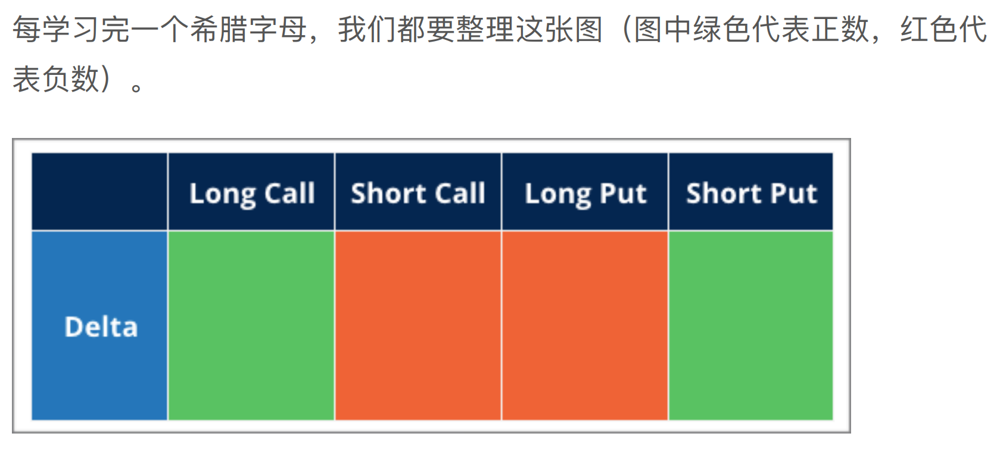
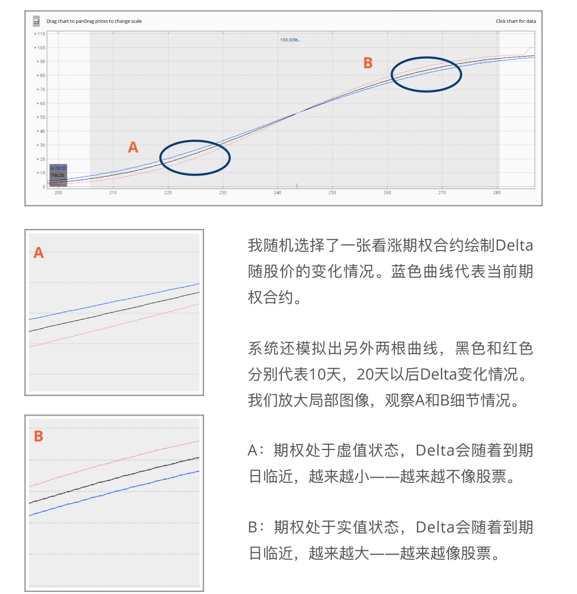
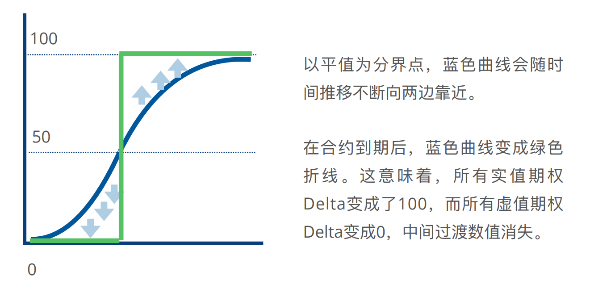
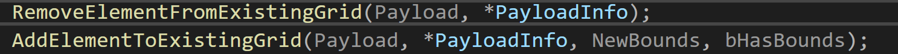

| 睡觉时间            | 13:10 |
| --------------- | ----- |
| 起床时间            | 8:30  |
| 健身              | ×     |
| cuda challenges | ×     |
| ipc             | 0h    |
昨晚上没有困意，但是一闭眼很快就睡着了。
# 跳

## 期权

### Delta

定义如下


神奇的习惯


深层次的理解


字母符号总结



Delta 随时间变化而变化




## PhysX Scene Query

看[官方文档](https://docs.nvidia.com/gameworks/content/gameworkslibrary/physx/guide/Manual/SceneQueries.html#introduction)
```
The Scene Query system uses two different acceleration structures, a hierarchical grid and an AABB tree.

The grid builds quickly, in O(n) time, with queries executing in between O(1) and O(N) time depending on how uniformly the objects are distributed in space, with pathological worst case performance of O(N) when all objects are clustered in the same grid cell.

The tree builds in O(nlog(n)) time, but queries with a single result typically run in O(log(n)) time. Queries returning multiple results will traverse more of the tree, the worst case being a query returning all of the objects in the scene in O(n) time. The tree is vulnerable to degeneration when the same topology is maintained too long as object positions change, and in pathological cases query performance may degrade to O(n) time.
```

### PxPruningStructureType::eNONE[](https://docs.nvidia.com/gameworks/content/gameworkslibrary/physx/guide/Manual/SceneQueries.html#pxpruningstructuretype-enone "Permalink to this headline")

```
The acceleration structure is similar to a hierarchical grid. Committing changes requires a full rebuild. This is a good choice if you expect to rarely or never update the objects in this structure.
```

### PxPruningStructureType::eSTATIC_AABB_TREE[](https://docs.nvidia.com/gameworks/content/gameworkslibrary/physx/guide/Manual/SceneQueries.html#pxpruningstructuretype-estatic-aabb-tree "Permalink to this headline")

```
The acceleration structure is a tree. Committing changes requires a full rebuild. It is not generally recommended, but can be a good choice for staticStructure if the static actors in your scene are created on initialization, and not modified thereafter. If you frequently add or remove static geometry, the default eDYNAMIC_AABB_TREE setting is usually a better choice, although it has a higher memory footprint than that of eSTATIC_AABB_TREE.
```
### PxPruningStructureType::eDYNAMIC_AABB_TREE[](https://docs.nvidia.com/gameworks/content/gameworkslibrary/physx/guide/Manual/SceneQueries.html#pxpruningstructuretype-edynamic-aabb-tree "Permalink to this headline")
```
In this case, both the tree and the grid are used, and each query searches both the tree and the grid.

The tree is initially built by the first commit. Once a tree is built, committing changes proceeds as follows:: * the tree is refitted in accordance with updates and removals of object it contains. * added objects are inserted into the grid. Such additions, or removals of objects currently in the grid, or changes to AABBs of objects in the grid, cause it to be rebuilt.

In addition, a new tree is incrementally built during fetchResults(), over a number of frames controlled by PxScene's dynamicTreeRebuildRateHint attribute. When the build starts, it includes all of the objects in the current tree and grid. When it finishes, some frames later, the new tree is refitted in accordance with any AABB changes or removals since the build started, and then replaces the current tree. Any objects that were added since the start of the build remain in the grid.
```
To force a full immediate rebuild, call PxScene::forceDynamicTreeRebuild(). This can be useful in cases such as the following:

- a slow rebuilt rate is typically desirable, but occasionally a large number of object additions creates high occupancy in the grid, especially if the additions are localized so as to put pressure on just a few of the grid cells.
- you are moving many objects across large distances, since refitting may significantly degrade the quality of the current tree

## Chaos源码

今天来看看chaos中其他空间加速结构怎么写的

```cpp
struct FBroadPhaseConfig
{
	enum 
	{
		Grid = 0,
		Tree = 1,
		TreeOfGrid = 2,
		TreeAndGrid = 3,
		TreeOfGridAndGrid = 4
	};
}
```
### Grid
通过 p.BroadphaseType 来调整, Grid这种空间网格的想法挺简单的，每次更新就只用删掉之前格子里存的刚体，然后把运动后的刚体加入进去。


### Tree of Grid
Tree of Grid启用的时候，发现树只有1个节点了，并且该节点里面存的不再是刚体而是一个Grid，有可能它是想把很多个Grid组成一个bvh树，不过我这里整个场景全部被包在一个Grid里面了，所以只有一个节点。并且树不需要更新，因为树里面就一个节点。

